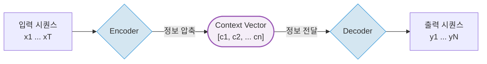
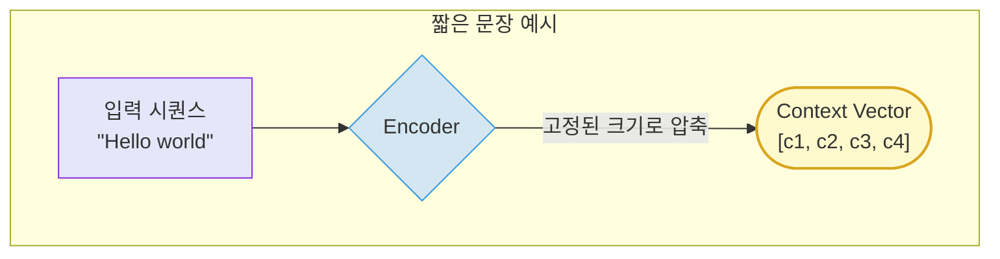
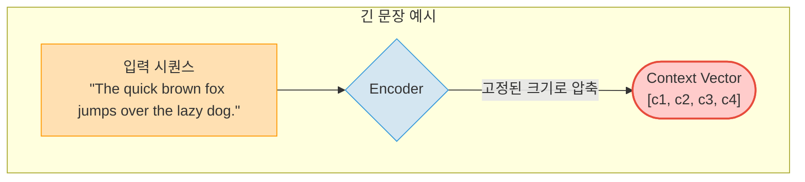
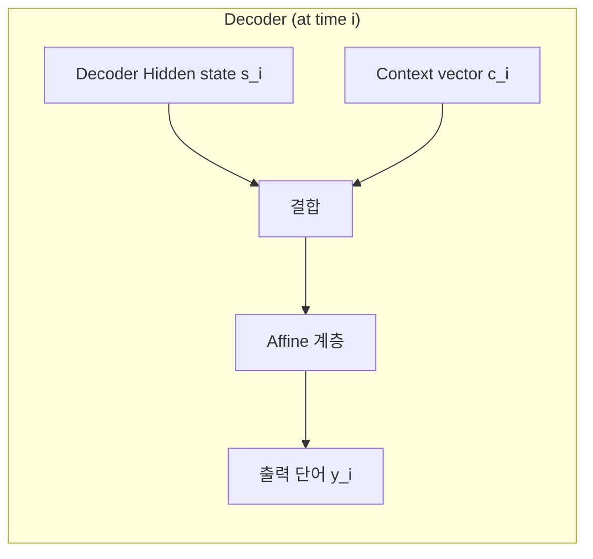

## 1. Seq2Seq 기본 아이디어

Seq2Seq(Sequence-to-Sequence) 모델은 시계열 데이터인 입력 시퀀스(e.g., 문장)를 받아 출력 시퀀스(e.g., 번역 결과 등)로 변환하는 신경망 구조로, 핵심 구조를 살펴보면 다음과 같습니다.

1. Encoder: 입력 문장을 단어 단위로 처리하여 hidden state를 생성.
2. Context Vector: 인코더의 정보를 요약해 디코더로 전달.
3. Decoder: Context Vector와 이전에 생성한 단어를 입력으로 받아 새로운 단어를 순차적으로 생성.

---

## 2. Seq2Seq의 문제점

기존 Seq2Seq 모델의 인코더는 입력 시퀀스의 길이에 관계없이 고정된 크기(fixed-size)의 단일 컨텍스트 벡터를 생성합니다. 이는 짧은 문장이든 긴 문장이든 동일한 차원의 벡터로 정보를 압축한다는 의미입니다.

* **단점**: 입력 시퀀스가 길어질수록 컨텍스트 벡터에 모든 정보를 담기 어려워져, 중요한 정보가 손실되거나 왜곡될 가능성이 커집니다.

이러한 한계를 극복하기 위한 개선 방안은 크게 두 가지 방향으로 접근할 수 있습니다.

1. **인코더 측면**: 입력 시퀀스 길이에 따라 인코더의 출력(컨텍스트) 크기가 유연하게 달라지도록 개선.
2. **디코더 측면**: 매 출력 시점마다 입력 시퀀스의 특정 부분에 더욱 집중(Attention)하여 정보를 활용.

아래에서서 각 개선 방안에 대해 구체적으로 살펴보겠습니다.

---

## 3. 인코더의 개선

### 인코더의 모든 정보 활용하기

앞서 우리는 인코더가 문장의 모든 정보를 고정된 크기의 컨텍스트 벡터 하나에 압축하면서 정보 손실이 발생하는 한계점을 확인했습니다.

그렇다면 이 컨텍스트 벡터는 어떻게 만들어졌을까요? 바로 인코더의 "마지막 Hidden State(은닉 상태)"입니다. 이 말은, 문장의 의미를 요약하는 과정에서 생성되었던 중간 시점의 모든 Hidden State들은 버려졌다는 뜻입니다.

이 문제를 해결하기 위한 첫 번째 아이디어는 간단합니다. "마지막 Hidden State 하나만 넘기지 말고, 모든 시점(각 단어)의 Hidden State를 전부 넘겨주자"는 것입니다.

이렇게 하면 인코더의 출력은 더 이상 고정된 크기의 벡터 하나가 아니라, 입력 문장의 길이에 따라 크기가 결정되는 **Hidden State들의 시퀀스(또는 행렬) $H$** 가 됩니다.

  

* 위 그림처럼, 각 단어($x_t$)가 인코더를 거쳐 해당 시점까지의 정보를 요약한 $h_t$ (Hidden State) 벡터를 출력합니다.
* 인코더는 이 Hidden State 벡터($h1$, $h2$, $h3$, $h4$) 전체를 디코더로 전달합니다.
* 장점: 문장이 길어져도 중간 정보들이 손실되지 않고 보존되므로, 디코더는 더 풍부한 정보를 바탕으로 출력을 생성할 수 있습니다.

이처럼 인코더가 '모든 정보'를 넘겨주도록 개선하면, 이제 디코더는 이 정보들을 어떻게 효과적으로 '선택'해서 사용할지에 대한 새로운 과제가 생깁니다. 이 과제를 해결하는 것이 바로 **어텐션(Attention)** 메커니즘입니다.

---

## 4. 디코더의 개선 (Attention 메커니즘)

이제 인코더가 풍부한 정보가 담긴 Hidden State 시퀀스 $H$를 제공하므로, 디코더는 이 정보를 효과적으로 활용해야 합니다. 하지만 단순히 모든 hidden state를 넘겨주면 **정보는 많지만, 디코더가 어디를 참고해야 할지 알 수 없습니다.**.

사람이 번역할 때 특정 단어에 집중하는 것처럼, 모델도 **디코더가 단어를 생성할 때 입력 문장의 어떤 부분에 집중할지** 결정해야 합니다.
이 문제를 해결하는 것이 바로 **Attention**입니다.

그러면 이제 Attention이 $H$를 이용하여 어떻게 context vector를 계산하는지 살펴봅니다.

---

### 4.1 Attention Score 계산

어텐션 스코어(Attention Score)를 계산하는 가장 기본적인 방식은, 디코더가 출력 시점 $i$의 단어를 예측하기 위해 가진 자신의 Hidden State $s_i$를 인코더의 전체 Hidden State 집합 $H$에 속한 각각의 Hidden State $h_j$와 내적(dot product)하는 것입니다.

* **$s_i$ (Decoder Hidden State; Query)**: "다음에 어떤 단어가 와야 할까?"라는 질문의 맥락을 담고 있는, 디코더의 현재 상태 벡터입니다.
* **$h_j$ (Encoder Hidden State; Key)**: 입력 문장의 $j$번째 단어가 가진 정보를 요약한 벡터입니다. 이 'Key'에 대해 'Query'와의 관련성을 계산하게 됩니다.

$$e_{ij} = s_i \cdot h_j$$

이 $e_{ij}$를 **Attention Score**라 부릅니다. 이 스코어는 디코더의 '질문'($s_i$)과 입력 문장의 각 단어가 가진 '정보'($h_j$)가 얼마나 관련이 깊은지를 나타내는 척도입니다. 스코어가 클수록 해당 입력 단어가 현재 출력 단어를 결정하는 데 더 중요하다고 해석할 수 있습니다.

> **참고**: Score를 계산하는 방식은 여러 가지가 있습니다.
>
> * **Bahdanau (Additive)**:   $e_{ij} = W_a^\top \tanh(W_b s_{i-1} + W_c h_j)$
>
> * **Luong (Multiplicative)**: $e_{ij} = s_i^\top W h_j$
>   * $s_{i-1}$: **이전 시점**의 디코더 Hidden State
>   * $h_j$: $j$번째 인코더 Hidden State
>   * $W$: 학습 가능한 가중치 행렬 및 벡터

---

### 4.2 Softmax로 Attention Weight 계산

위에서 계산한 Attention score를 softmax로 정규화해 **Attention Weight** $\alpha_{ij}$를 얻습니다. (확률분포화)

$$
\alpha_{ij} = \frac{\exp(e_{ij})}{\sum_{k=1}^T \exp(e_{ik})}
$$

* $\alpha_{ij}$: 디코더 시점 $i$에서 인코더 단어 $j$가 얼마나 중요한지 나타내는 값
* 확률 분포이므로 $\sum_j \alpha_{ij} = 1$

---

### 4.3 Context Vector 계산

이렇게 계산된 Attention Weight를 가중치로 사용하여, 인코더 Hidden State들의 가중합을 계산해 Context Vector를 만듭니다.

$$
c_i = \sum_{j=1}^T \alpha_{ij} \cdot h_j
$$

즉, context vector $c_i$는 입력 단어들의 **중요도를 반영한 요약 벡터**입니다.

위 4.1 부터 4.3까지의 과정, 즉 한 번의 Attention이 계산되는 과정을 그림으로 표현하면 다음과 같습니다.

  

## 5. Attention을 포함한 Decoder

기존 디코더는 hidden state 하나만 사용했지만, Attention을 포함하면 앞에서 계산한 맥락 벡터 $c$를 추가 입력으로 활용할 수 있습니다.

이렇게 두 정보를 결합하면 최종적으로 단어를 예측하는 Affine 계층에게 두 가지 종류의 정보를 동시에, 그리고 명확하게 구분하여 제공할 수 있습니다.

1. $s_i$ (Decoder Hidden State): 지금까지 내가 어떤 단어들을 출력했었는지에 대한 정보 (내부적인 문맥)
2. $c_i$ (Context Vector): 지금 출력할 단어를 위해 입력 문장의 어떤 부분을 집중해서 봐야 하는지에 대한 정보 (외부적인 문맥)

모델은 이 두 정보를 모두 활용하여 훨씬 더 정확하게 다음 단어를 예측할 수 있습니다.

>참고: '결합'하는 다른 방법으로 두 벡터를 단순히 더하는 addition 방식도 있지만, 일반적으로는 정보를 보존하기 위해 concatenation 방식이 더 널리 사용됩니다.

---

## 6. 시간에 따른 어텐션 디코더의 동작

Attention은 디코더의 모든 시점마다 수행됩니다. 즉, 각 단어를 생성할 때마다 새로운 Attention 계산(Score 계산, Weight 계산, Context Vector 계산)이 반복적으로 이루어집니다.

아래는 이러한 전체 과정을 보여줍니다. 디코더가 단어를 하나씩 생성할 때마다 Softmax 위의 어텐션 가중치(파란색 막대)가 계속해서 변합니다. 이는 매번 다른 단어를 출력하는 시점마다 그 시점에 최적화된 새로운 Context Vector를 만들고 있다는 의미입니다.

    
  
  (출처: [Lena Voita Blog - Sequence to Sequence (seq2seq) and Attention](https://lena-voita.github.io/nlp_course/seq2seq_and_attention.html) )

---

## 7. 요약: Encoder + Attention을 포함한 Decoder 메커니즘의 전체 흐름

1. Encoder는 입력 문장을 받아 모든 시점의 Hidden States ($H$)를 생성합니다. 이는 디코더가 참고할 정보의 원천(각 Key $h_j$ 들의 집합)이 됩니다.
2. Decoder는 $i$번째 단어를 예측하기 위해 현재까지의 요약 정보인 Hidden State ($s_i$)를 가집니다. 이는 '어떤 정보가 필요한가?'라는 질문(Query) 역할을 합니다.
3. Attention을 이용한 정보 선별:
      * **Attention Score 계산**: 디코더의 질문($s_i$)과 인코더의 모든 정보($H$)를 비교하여 **Attention Score**를 계산합니다.
      * **Attention Weight 계산**: Score를 Softmax로 정규화하여 집중할 비율인 **Attention Weight**를 얻습니다.
      * **Context Vector 생성**: Weight를 이용해 각 $h_j$를 가중합하여, 현재 질문에 가장 적합한 맞춤형 정보인 Context Vector ($c_i$)를 만듭니다.
4. Decoder, 단어 예측: Decoder는 자신의 상태($s_i$)와 어텐션을 통해 얻은 맞춤형 정보($c_i$)를 **결합**하여 최종적으로 $i$번째 단어($y_i$)를 출력합니다.

---

## References

* [Lena Voita Blog - Sequence to Sequence (seq2seq) and Attention](https://lena-voita.github.io/nlp_course/seq2seq_and_attention.html)
* [Attention in RNN (Bahadanau, Luong)](https://dive-into-ds.tistory.com/121)
