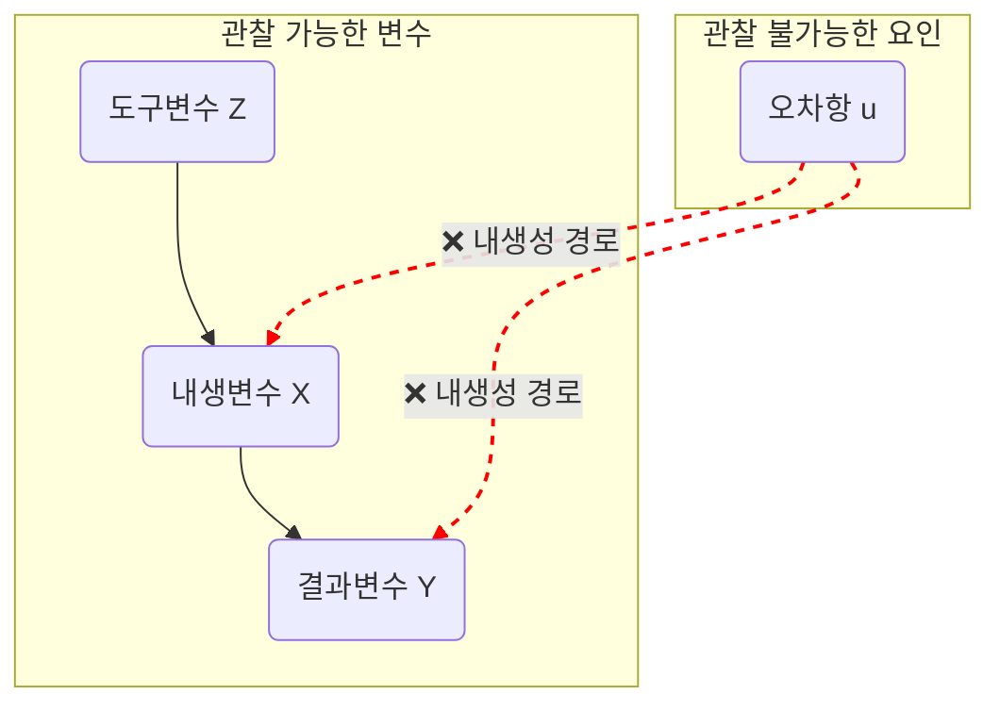

## 우리가 보는 상관관계는 진짜 '인과관계'일까요?

"아이스크림 판매량이 늘면 상어의 공격 횟수도 늘어난다"는 유명한 통계가 있습니다. 이 말만 들으면 아이스크림이 상어를 더 공격적으로 만드는 것처럼 보입니다. 하지만 정말 그럴까요? 당연히 아닙니다. '더운 날씨'라는 숨겨진 요인이 아이스크림 판매량과 해수욕객 수를 동시에 늘리기 때문에 나타나는 가짜 상관관계일 뿐입니다.

이처럼 데이터 분석에서 상관관계를 인과관계로 착각하는 실수는 매우 흔하며, 이를 **내생성(Endogeneity)** 문제라고 부릅니다. 우리가 믿고 사용하는 OLS 회귀분석이 바로 이 내생성 문제 때문에 우리를 배신하고 잘못된 결론을 내놓을 수 있습니다.

## 1. 왜 OLS만으로는 부족한가? 내생성(Endogeneity) 문제

우리가 흔히 사용하는 회귀분석(OLS)은 "X가 변할 때 Y가 얼마나 변하는가?"라는 인과관계를 추정하는 강력한 도구입니다.

### 1-1. 기본 OLS 회귀식

표준적인 OLS 회귀모형은 다음과 같이 표현됩니다:

$$
Y = \beta_0 + \beta_1 X + \beta_2 W + u
$$

- $Y$: 결과변수 (종속변수)
- $X$: 관심 설명변수
- $W$: 통제변수들 (외생적 변수들)
- $u$: 오차항 (관찰되지 않는 요인들)
- $\beta_1$: 우리가 추정하고자 하는 X의 인과적 효과

통제변수 $W$ 를 포함하는 이유는 $Y$ 에 영향을 미치는 요인들이 $X$ 외에도 존재할 수 있기 때문입니다. 이러한 변수들을 통제함으로써 $X$ 의 순수한 효과를 분리해내려는 것이죠.

### 1-2. OLS의 핵심 가정

OLS가 정확한 인과관계를 추정하기 위한 핵심 가정 중 하나는 **설명변수(X)가 오차항(u)과 상관관계가 없어야 한다 $(Cov(X, u)=0)$** 는 것입니다. 오차항 $u$ 는 우리가 모델에 포함하지 못한 수많은 요인(재능, 날씨, 운 등)을 담고 있습니다.

현실의 데이터는 이 가정을 위배하는 경우가 많으며, 이를 **내생성(Endogeneity)** 문제라고 부릅니다. 내생성은 주로 다음 세 가지 원인으로 발생합니다.

1. **누락변수 편의 (Omitted Variable Bias)**: Y와 X에 동시에 영향을 미치는 중요한 변수(Z)를 모형에서 빠뜨렸을 때 발생합니다. (예: 교육수준(X)이 임금(Y)에 미치는 영향을 분석할 때, 개인의 '능력'을 통제하지 못하는 경우)
2. **동시성 편의 (Simultaneity Bias)**: X가 Y에 영향을 미치지만, 동시에 Y도 X에 영향을 미치는 경우입니다. (예: 경찰관 수(X)와 범죄율(Y)의 관계)
3. **측정 오차 (Measurement Error)**: 설명변수 X에 무작위적이지 않은 측정 오차가 있을 경우 발생합니다.

내생성 문제가 존재하면 OLS 추정량은 편의(biased)되고 일치성(consistent)을 잃게 되어, 우리가 찾은 X의 계수 $(\hat{\beta_1})$ 를 신뢰할 수 없게 됩니다.

## 2. 내생성의 해결사: 도구변수(IV)의 등장

이러한 내생성 문제를 해결하기 위해 등장한 것이 바로 **도구변수(Instrumental Variable, IV)** 입니다. 도구변수 `Z`는 내생성을 갖는 설명변수 `X`와는 관련이 있지만, 결과변수 `Y`에는 직접적인 영향을 주지 않는 제3의 변수입니다.

좋은 도구변수가 되기 위한 두 가지 핵심 조건은 다음과 같습니다.

> 1. **관련성 (Relevance Condition)**: 도구변수(Z)는 내생변수(X)와 강한 상관관계가 있어야 합니다.
>     - $Cov(Z, X) \neq 0$
>     - 즉, Z가 변할 때 X가 예측 가능하게 움직여야 합니다.
> 2. **배제 제약 (Exclusion Restriction)**: 도구변수(Z)는 **오직 내생변수(X)를 통해서만** 결과변수(Y)에 영향을 미쳐야 합니다. 즉, Z가 Y에 직접적인 영향을 주어서는 안 됩니다.
>     - $Cov(Z, u) = 0$
>     - 이것이 IV 분석의 가장 핵심적이고 강력한 가정입니다. 이 가정은 통계적으로 검증이 불가능하며, 이론과 논리에 기반해 정당화해야 합니다.

아래 경로 다이어그램은 이러한 관계를 직관적으로 보여줍니다. 내생성은 관찰되지 않는 요인 `u`가 `X`와 `Y` 모두에 영향을 주기 때문에 발생합니다. 도구변수 `Z`는 `X`에는 영향을 주지만(관련성), `Y`나 `u`와는 직접적인 연결이 끊어져 있어야(배제 제약) 합니다.

### 예시: 교육과 임금

- **연구 질문**: 교육(X)이 1년 늘면, 임금(Y)은 얼마나 오를까?
- **내생성 문제**: 개인의 타고난 '능력'이라는 누락변수가 교육수준과 임금 모두에 영향을 줍니다.
- **도구변수(Z) 아이디어**: 거주지와 대학 간의 거리
  - **관련성**: 다른 조건이 같다면, 대학 근처에 사는 학생이 대학에 갈 확률이 더 높을 것입니다. $(Cov(거리, 교육) \neq 0)$
  - **배제 제약**: 대학과의 '거리' 자체가 개인의 임금에 직접적인 영향을 주지는 않을 것입니다. 오직 '교육 수준'을 높이는 경로를 통해서만 임금에 영향을 줄 것이라고 가정할 수 있습니다. (거리가 가깝다고 갑자기 임금이 오르진 않음)

이때 '대학과의 거리'라는 도구변수를 이용하면, '능력'과 무관하게 오직 거리가 가까워서 대학에 더 가게 된 사람들의 교육 수익률, 즉 순수한 인과효과에 가까운 값을 추정할 수 있습니다.

## 3. 2단계 최소제곱법(2SLS)의 메커니즘

2단계 최소제곱법(2-Stage Least Squares, 2SLS)은 도구변수(IV)를 활용하여 인과관계를 추정하는 가장 대표적인 방법입니다. 이름처럼 두 단계의 회귀분석으로 이루어집니다.

### 3-1. 2SLS의 작동 원리

1단계 과정은 마치 설명변수 X에서 내생성이라는 "불순물(오차항 u와의 상관성)을 걸러내는 정수 필터"와 같습니다. 도구변수 Z라는 필터를 통과시켜 오직 외생적인 요인으로만 설명되는 깨끗한 물 $(\hat{X})$ 을 얻어내는 과정이죠. 그리고 2단계에서는 이 깨끗해진 물을 사용해 `Y` 와의 순수한 관계를 측정하는 것입니다.

#### 1단계 (First Stage): X에서 내생성이 없는 부분만 골라내기

내생성이 있는 설명변수 `X`를 종속변수로 놓고, 도구변수 `Z`와 다른 외생 통제변수들(`W`)을 설명변수로 하여 회귀분석을 실행합니다.

$$
X = \pi_0 + \pi_1 Z + \pi_2 W + v
$$

이 회귀분석의 목적은 X의 변동 중에서 오로지 도구변수 `Z`에 의해서만 설명되는 부분을 분리해내는 것입니다. 이 단계에서 얻은 X의 예측값 $(\hat{X})$ 을 구합니다. 이 $\hat{X}$ 는 `Z`와 `W`로만 이루어져 있으므로, 원래 Y의 오차항(`u`)과 상관관계가 없는 "깨끗한 X"가 됩니다.

#### 2단계 (Second Stage): 깨끗해진 X로 진짜 효과 추정하기

원래의 회귀식에서 문제가 되었던 `X` 대신, 1단계에서 구한 깨끗한 예측값 $\hat{X}$ 를 넣어서 회귀분석을 실행합니다.

$$
Y = \beta_0 + \beta_1 \hat{X} + \beta_2 W + u
$$

여기서 얻은 $\hat{\beta_1}$ 이 바로 내생성 문제가 해결된, 우리가 찾고자 하는 X의 인과적 효과에 대한 **일치 추정량(consistent estimator)** 입니다.

### 3-2. 도구변수 조건의 통계적 검증

#### 관련성 검증 (Test of Relevance)

1. 우선 1단계 회귀식에서 도구변수 `Z`의 계수($\pi_1$)가 통계적으로 유의한지($H_0: \pi_1=0$ 기각) 확인합니다.
2. 하지만 더 중요한 것은 **약한 도구변수(Weak Instrument)** 문제를 확인하는 것입니다. `Z`와 `X`의 상관관계가 너무 약하면 2SLS 추정량의 편의가 커지고 표준오차가 부정확해집니다.
    - **검증 방법**: 1단계 회귀식에서 배제된 도구변수(excluded instruments) 들에 대한 F-통계량 을 확인합니다. 일반적으로 $F > 10$ 이면 약한 도구변수 문제를 피할 수 있다고 봅니다. (Staiger & Stock, 1997의 경험칙)
    - **주의**: F-통계량이 10보다 낮으면 2SLS 추정량은 편의(bias)가 커져 원래의 OLS 추정량과 비슷해지는 심각한 문제가 발생합니다. 즉, 내생성 문제를 해결하려고 IV를 썼는데, 해결은 안 되고 오히려 표준오차만 커져 분석을 망칠 수 있습니다.

#### 배제 제약 검증 (Test of Exclusion Restriction)

앞서 말했듯이 이 가정은 근본적으로 통계적 검증이 불가능합니다. 단, 내생변수(`X`)의 개수보다 도구변수(`Z`)의 개수가 더 많을 때 (이를 과잉식별(over-identified) 되었다고 합니다), 간접적인 테스트를 해볼 수 있습니다.

- **검증 방법**: 과잉식별 검정 (Overidentification Test, 예: Sargan-Hansen J-test). 이 검정의 아이디어는 "만약 모든 도구변수가 정말 외생적이라면, 추가적인 도구변수들은 2단계 회귀식의 오차항과 상관관계가 없어야 한다"는 것입니다.
- **해석**: 귀무가설($H_0$)은 "모든 도구변수는 외생적이다" 입니다. 따라서 "p-value가 크게 나와 귀무가설을 기각하지 못하는 것"이 좋은 결과입니다.

### 3.3. IV 추정량의 직관적 이해

2SLS는 도구변수를 활용하는 대표적인 방법이지만, 도구변수의 원리를 더 간단한 수식으로 이해할 수도 있습니다. 통제변수 W가 없는 가장 간단한 모델을 생각해봅시다. 이때의 IV 추정량은 다음과 같이 표현됩니다.

$$\hat{\beta}_{IV} = \frac{Cov(Z, Y)}{Cov(Z, X)}$$

이 수식은 IV의 본질을 압축적으로 보여줍니다.

- **분자 ($Cov(Z, Y)$)**: 도구변수 Z가 변할 때 결과변수 Y가 얼마나 변하는가? (Z → Y의 전체 관계)
- **분모 ($Cov(Z, X)$)**: 도구변수 Z가 변할 때 내생변수 X가 얼마나 변하는가? (Z → X의 관계, 즉 1단계)

결국 IV 추정량은 **"Z가 Y에 미치는 전체 효과를 Z가 X를 움직이는 힘으로 나누어준 값"** 입니다. Z는 오직 X를 통해서만 Y에 영향을 줄 수 있다고 가정했으므로(배제 제약), 이 비율을 계산함으로써 X가 Y에 미치는 순수한 인과효과($\beta_1$)를 간접적으로 추정하는 것입니다.

  

수식 도출 과정 보기
  

 

구조 방정식:

$$
Y = \beta_0 + \beta_1 X + u
$$

 

(여기서는 설명을 위해 통계변수 W가 없는 모델을 사용합니다. 프리슈-워-로웰(Frisch-Waugh-Lovell) 정리에 따라 $Y = \beta_0 + \beta_1 X + \beta_2 W + u$ 에서 2SLS를 실행하여 얻은 $\hat{\beta}_1$ 의 값과 W의 효과를 먼저 제거한 후 $Y^* = \alpha_0 + \beta_1 X^* + \text{error}$ 에서 도구변수 `Z*`를 사용하여 얻은 $\hat{\beta}_1$의 값은 수학적으로 동일합니다.)  

  

핵심 가정:  

  

1. 관련성: $Cov(Z, X) \neq 0$  

  

2. 배제 제약: $Cov(Z, u) = 0$  

  

유도 과정:  

  

1. 구조 방정식 양변에 도구변수 Z와의 공분산(Covariance)을 취합니다.  
    $$Cov(Z, Y) = Cov(Z, \beta_0 + \beta_1 X + u)$$  

2. 공분산의 성질($Cov(A, B+C) = Cov(A,B) + Cov(A,C)$, $Cov(A, 상수) = 0$)을 이용해 우변을 전개합니다.  

    $$Cov(Z, Y) = Cov(Z, \beta_0) + Cov(Z, \beta_1 X) + Cov(Z, u)$$
    $$Cov(Z, Y) = 0 + \beta_1 Cov(Z, X) + Cov(Z, u)$$

3. 배제 제약 가정($Cov(Z, u) = 0$)을 적용합니다.  
    $$Cov(Z, Y) = \beta_1 Cov(Z, X) + 0$$

4. $\beta_1$에 대해 정리합니다. (관련성 가정($Cov(Z, X) \neq 0$) 하에 양변을 나눌 수 있습니다.)  
    $$\beta_1 = \frac{Cov(Z, Y)}{Cov(Z, X)}$$

따라서 $\beta_1$의 추정량은 다음과 같습니다.  
$$\hat{\beta}_{IV} = \frac{\widehat{Cov}(Z, Y)}{\widehat{Cov}(Z, X)}$$

## 4. 2SLS의 결과, OLS처럼 해석해도 될까?

운 좋게 이론적으로 완벽한 IV를 찾았다고 가정해 봅시다. 그렇다면 2SLS로 추정한 계수 $\hat{\beta}_{2SLS}$ 는 우리가 OLS로 추정하고자 했던 **'모든 대상의 평균적인 인과 효과(Average Treatment Effect)'** 와 같을까요?

### 4-1. 2SLS는 무엇을 추정하는가? - LATE (국소 평균 치료 효과)

결론부터 말하면, 반드시 그렇지는 않습니다.

2SLS 추정량은 모집단 전체의 평균적인 효과(ATE)가 아니라, 매우 특별한 일부 집단의 효과, 즉 **국소 평균 치료 효과(Local Average Treatment Effect, LATE)** 를 일치적으로(consistently) 추정하기 때문입니다.

LATE란, 도구변수(Z)의 변화 때문에 내생변수(X)에 대한 행동이 바뀐 집단, 즉 "응답자(Compliers)"에게서만 나타나는 평균적인 인과 효과를 의미합니다. 이는 OLS가 추정하려 했던 '모든 대상'의 평균 효과와는 다른 개념일 수 있으며, 이 차이를 이해하는 것이 IV 분석 결과를 정확히 해석하는 핵심입니다.

#### 예시: 베트남전 징집 복무와 평생 소득 (Angrist & Krueger, 1991)

- **연구 질문**: 군 복무(X)가 소득(Y)에 미치는 영향은?
- **도구변수(Z)**: 징집 추첨 번호 (낮은 번호를 받으면 징집 확률 상승)

이때 2SLS는 "징집 제도 때문에 어쩔 수 없이 군대에 끌려간 사람들(Compliers)"의 소득에 미치는 영향을 측정합니다. 자원입대자(Always-Takers)나 무슨 수를 써서라도 군대에 안 갈 사람(Never-Takers)의 효과는 측정하지 않습니다. 이는 정책적 함의가 매우 큰 중요한 개념입니다.

## 5. IV 방법론의 사용 예시: 제도와 경제 성장 (Acemoglu, Johnson, and Robinson, 2001)

LATE의 개념은 IV/2SLS의 해석을 더 복잡하게 만들지만, 오히려 도구변수가 '어떤 메커니즘'을 통해 인과관계를 식별하는지 명확히 보여주는 장점입니다. 이러한 IV의 힘을 가장 잘 보여주는 연구 중 하나가 바로 제도와 경제 성장의 관계를 분석한 Acemoglu, Johnson, and Robinson (AJR)의 2001년 논문입니다.

- **연구 질문**: 좋은 제도(X, 예: 사유재산권 보호)가 1인당 GDP(Y)를 높이는가?
- **내생성 문제**: 부유한 국가가 좋은 제도를 만들 여유가 있을 수도 있고(동시성), 지리나 문화 같은 제3의 요인이 제도와 성장 모두에 영향을 줄 수 있습니다(누락변수).
- **도구변수(Z)**: 19세기 초 식민지 개척 당시 유럽인 정착민의 사망률
  - **관련성 (Relevance)**: 정착민 사망률이 높았던 지역(예: 말라리아 창궐 지역)에서는 유럽인들이 직접 정착하여 살기보다 자원만 수탈하는 '착취적(extractive)' 제도를 만들었습니다. 반면, 사망률이 낮아 살기 좋았던 지역(미국, 호주 등)에서는 자신들의 재산을 보호하기 위한 **'포용적(inclusive)' 제도**를 이식했습니다. 따라서 과거의 사망률은 현재 제도의 질과 강한 음(-)의 상관관계를 가집니다.
  - **배제 제약 (Exclusion Restriction)**: 과거 정착민 사망률은 오직 '제도'라는 경로를 통해서만 현재의 1인당 GDP에 영향을 준다고 가정합니다. 즉, 과거의 질병 환경이 20세기 후반의 경제 성장에 직접적인 영향을 주지는 않는다는 강력한 가정입니다. 이 가정을 두고 수많은 후속 논쟁이 있었으며, 이는 좋은 IV 논문이 어떻게 학문적 논의를 촉발하는지 보여주는 대표적 사례입니다.

AJR(2001)의 사례는 IV/2SLS 분석의 정수를 보여줍니다. 그것은 단순히 복잡한 통계 기법을 적용하는 것이 아니라, 역사와 이론에 대한 깊은 이해를 바탕으로 창의적인 연구 설계를 하는 하나의 예술에 가깝습니다.

## 결론: 예술에 가까운 인과추론의 도구

결론적으로, OLS의 내생성 문제를 해결하기 위한 도구변수 방법론은 사회과학 전반에서 인과관계를 추론하는 매우 강력한 도구입니다. 하지만 그 강력함은 **"좋은 도구변수를 찾을 수 있는가"** 라는 매우 엄격한 조건에 달려있습니다.

IV/2SLS는 단순히 버튼을 눌러 결과를 얻는 자동화된 기술이 아닙니다. 연구자는 자신이 찾은 도구변수가 왜 관련성 가정을 만족하고, 왜 배제 제약 가정을 위반하지 않는지 집요하게 논증해야 합니다. 또한 그 결과가 전체가 아닌 특정 그룹(Compliers)에 대한 **"국소적(local)"** 효과임을 명확히 인지해야 합니다.

이러한 고민과 논증의 과정이야말로 데이터를 통해 진정한 인과관계에 한 걸음 더 다가가는 계량경제학의 묘미일 것입니다.

---

## References

_Angrist, Joshua D., and Jörn-Steffen Pischke (2015). Mastering 'Metrics: The Path from Cause to Effect. Princeton University Press._  
_Angrist, J. D., & Pischke, J.-S. (2009). Mostly harmless econometrics: An empiricist's companion. Princeton University Press._  
_Greene, W. H. (2018). Econometric analysis (8th ed.). Pearson._
