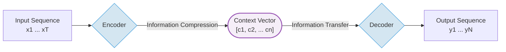
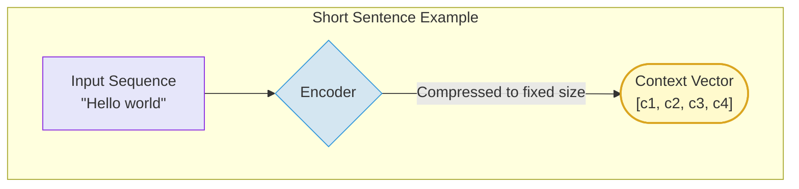
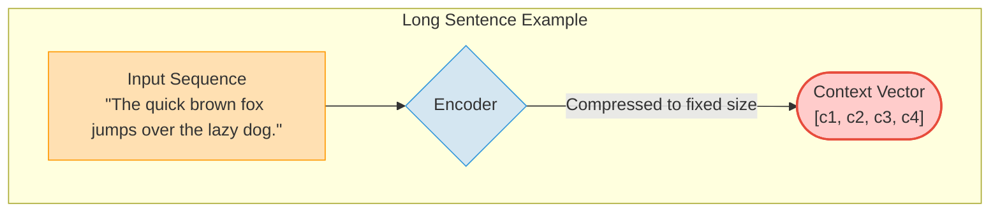
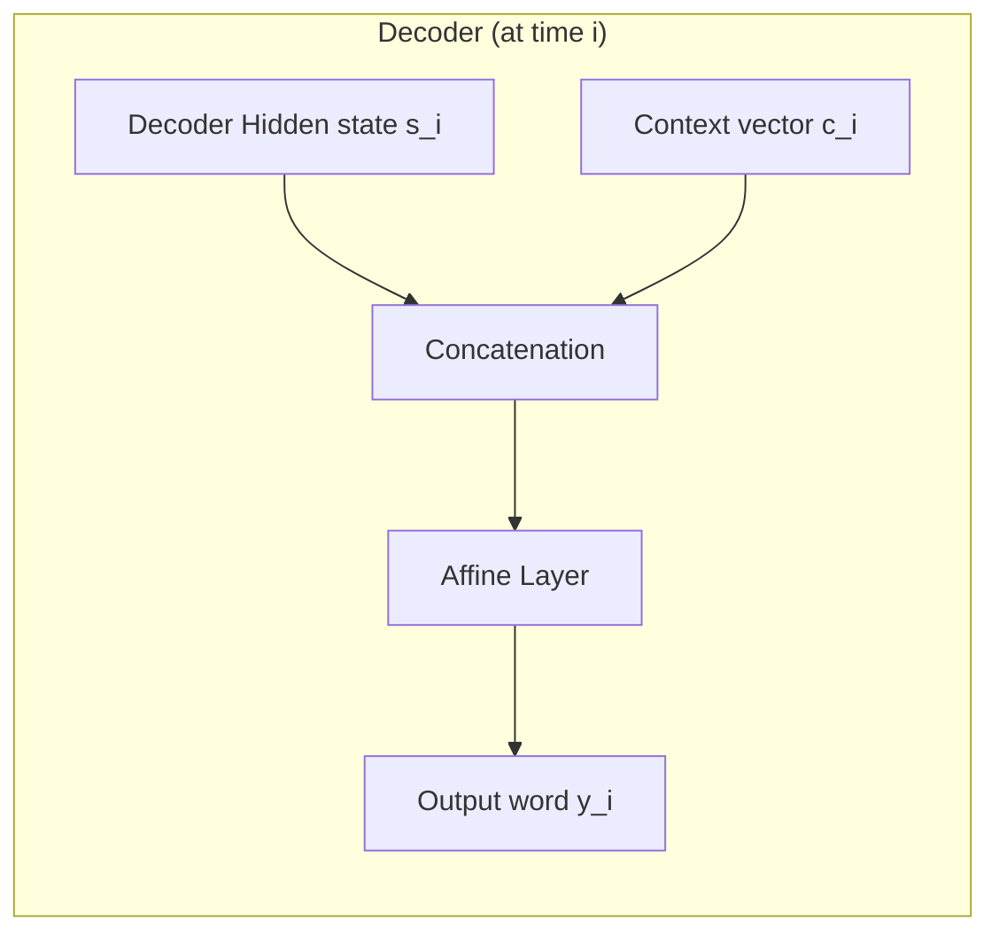

## 1. Seq2Seq Basic Idea

The Seq2Seq (Sequence-to-Sequence) model is a neural network architecture that takes an input sequence (e.g., a sentence) as time-series data and transforms it into an output sequence (e.g., translation result). Let's examine its core structure:

1. Encoder: Processes the input sentence word by word to generate hidden states.
2. Context Vector: Summarizes the encoder's information and passes it to the decoder.
3. Decoder: Takes the Context Vector and previously generated words as input to sequentially generate new words.

---

## 2. Problems with Seq2Seq

The encoder in the traditional Seq2Seq model generates a single fixed-size context vector regardless of the input sequence length. This means that both short and long sentences are compressed into a vector of the same dimension.

* **Disadvantage**: As the input sequence becomes longer, it becomes increasingly difficult to contain all information in the context vector, increasing the likelihood that important information will be lost or distorted.

There are two main approaches to overcome these limitations:

1. **Encoder Side**: Improve so that the encoder's output (context) size flexibly varies according to the input sequence length.
2. **Decoder Side**: Focus (Attention) on specific parts of the input sequence at each output time step to utilize information more effectively.

Let's examine each improvement approach in detail below.

---

## 3. Encoder Improvements

### Utilizing All Information from the Encoder

Earlier, we identified the limitation where the encoder compresses all sentence information into a single fixed-size context vector, causing information loss.

So how was this context vector created? It's the encoder's "last Hidden State." This means that all intermediate Hidden States generated during the sentence meaning summarization process were discarded.

The first idea to solve this problem is simple: "Instead of passing only the last Hidden State, let's pass all Hidden States from every time step (each word)."

This way, the encoder's output is no longer a single fixed-size vector, but rather a **sequence (or matrix) of Hidden States $H$** whose size is determined by the input sentence length.

  

* As shown in the diagram above, each word ($x_t$) passes through the encoder and outputs an $h_t$ (Hidden State) vector that summarizes information up to that time step.
* The encoder passes this entire set of Hidden State vectors ($h1$, $h2$, $h3$, $h4$) to the decoder.
* Advantage: Even as sentences get longer, intermediate information is not lost but preserved, allowing the decoder to generate output based on richer information.

By improving the encoder to pass 'all information' this way, a new challenge arises for the decoder: how to effectively 'select' and use this information. Solving this challenge is precisely what the **Attention** mechanism does.

---

## 4. Decoder Improvements (Attention Mechanism)

Now that the encoder provides a Hidden State sequence $H$ containing rich information, the decoder must effectively utilize this information. However, simply passing all hidden states means **there's a lot of information, but the decoder doesn't know where to look.**

Just as humans focus on specific words when translating, the model must also **decide which part of the input sentence to focus on when the decoder generates a word.**
Attention solves this problem.

Let's now examine how Attention uses $H$ to calculate the context vector.

---

### 4.1 Calculating Attention Score

The most basic way to calculate the Attention Score is for the decoder to dot product its own Hidden State $s_i$ at output time step $i$ with each Hidden State $h_j$ in the encoder's complete Hidden State set $H$.

* **$s_i$ (Decoder Hidden State; Query)**: The decoder's current state vector, containing the context of the question "What word should come next?"
* **$h_j$ (Encoder Hidden State; Key)**: A vector summarizing the information of the $j$-th word in the input sentence. The relevance with the 'Query' is calculated for this 'Key'.

$$e_{ij} = s_i \cdot h_j$$

We call this $e_{ij}$ the **Attention Score**. This score represents a measure of how deeply related the decoder's 'question' ($s_i$) is to the 'information' ($h_j$) each word in the input sentence possesses. The higher the score, the more important that input word is for determining the current output word.

> **Note**: There are various ways to calculate the Score.
>
> * **Bahdanau (Additive)**:   $e_{ij} = W_a^\top \tanh(W_b s_{i-1} + W_c h_j)$
>
> * **Luong (Multiplicative)**: $e_{ij} = s_i^\top W h_j$
>   * $s_{i-1}$: Decoder Hidden State from the **previous time step**
>   * $h_j$: $j$-th encoder Hidden State
>   * $W$: Learnable weight matrices and vectors

---

### 4.2 Calculating Attention Weight with Softmax

Normalize the Attention score calculated above with softmax to obtain the **Attention Weight** $\alpha_{ij}$. (Probability distribution)

$$
\alpha_{ij} = \frac{\exp(e_{ij})}{\sum_{k=1}^T \exp(e_{ik})}
$$

* $\alpha_{ij}$: Value indicating how important encoder word $j$ is at decoder time step $i$
* Since it's a probability distribution, $\sum_j \alpha_{ij} = 1$

---

### 4.3 Calculating Context Vector

Using these calculated Attention Weights as weights, compute a weighted sum of the encoder Hidden States to create the Context Vector.

$$
c_i = \sum_{j=1}^T \alpha_{ij} \cdot h_j
$$

In other words, the context vector $c_i$ is a **summary vector that reflects the importance of input words**.

The process from 4.1 to 4.3 above, i.e., the process of one Attention calculation, can be expressed as a diagram as follows:

  

## 5. Decoder with Attention

The traditional decoder used only one hidden state, but with Attention, it can utilize the context vector $c$ calculated earlier as an additional input.

By combining these two pieces of information, the final Affine layer that predicts words can be provided with two types of information simultaneously and clearly distinguished:

1. $s_i$ (Decoder Hidden State): Information about what words I have output so far (internal context)
2. $c_i$ (Context Vector): Information about which part of the input sentence to focus on for the word being output now (external context)

The model can predict the next word much more accurately by utilizing both pieces of information.

>Note: Another method of 'combining' is the addition approach of simply adding two vectors, but generally, concatenation is more widely used to preserve information.

---

## 6. Attention Decoder Operation Over Time

Attention is performed at every time step of the decoder. That is, a new Attention calculation (Score calculation, Weight calculation, Context Vector calculation) is repeated each time a word is generated.

Below shows this entire process. As the decoder generates words one by one, the attention weights (blue bars) above the Softmax keep changing. This means that a new Context Vector optimized for that time step is being created each time a different word is output.

  
   
  (Source: <a href="https://lena-voita.github.io/nlp_course/seq2seq_and_attention.html">Lena Voita Blog - Sequence to Sequence (seq2seq) and Attention</a>)

---

## 7. Summary: Complete Flow of Encoder + Decoder with Attention Mechanism

1. The Encoder receives the input sentence and generates Hidden States ($H$) for all time steps. This becomes the source of information (set of each Key $h_j$) that the decoder will reference.
2. To predict the $i$-th word, the Decoder has a Hidden State ($s_i$) that is a summary of information up to the current point. This serves as the Query asking "What information is needed?"
3. Information selection using Attention:
      * **Attention Score Calculation**: Compare the decoder's query ($s_i$) with all of the encoder's information ($H$) to calculate the **Attention Score**.
      * **Attention Weight Calculation**: Normalize the Score with Softmax to obtain the **Attention Weight**, which is the proportion to focus on.
      * **Context Vector Generation**: Use the Weight to compute a weighted sum of each $h_j$, creating a Context Vector ($c_i$) which is customized information best suited to the current query.
4. Decoder, Word Prediction: The Decoder **combines** its state ($s_i$) and the customized information obtained through attention ($c_i$) to finally output the $i$-th word ($y_i$).

---

## References

* [Lena Voita Blog - Sequence to Sequence (seq2seq) and Attention](https://lena-voita.github.io/nlp_course/seq2seq_and_attention.html)
* [Attention in RNN (Bahadanau, Luong)](https://dive-into-ds.tistory.com/121)
