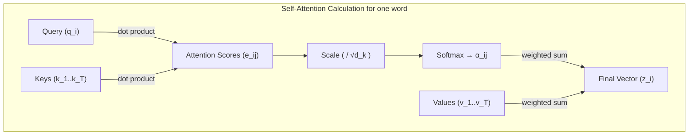

This article continues from the previous part [Seq2Seq and Attention Mechanism](https://jkim1209.github.io/posts/Attention/).

## 8. A New Question: Can We Understand Sentences with Attention Alone, Without RNN?

The attention mechanism we examined solved the chronic problem of 'information loss' in Seq2Seq models and dramatically improved translation quality. However, a fundamental limitation still remained: **the sequential computation method of RNN**.

RNN (including LSTM and GRU) processes calculations sequentially from the first word to the last word of a sentence.

* **Disadvantage 1: Slow Speed**: Since words must be processed sequentially one by one, computation time increases linearly as sentences get longer. Parallel processing is difficult, preventing maximum utilization of GPU performance.
* **Disadvantage 2: Distance Problem of Information**: Even with attention, it was still difficult to grasp the relationship between words that are physically distant, such as words at opposite ends of a sentence.

At this point, Google researchers posed a bold question:

> "Could we eliminate RNN entirely and understand the relationships and meanings of words within a sentence using only attention?"

The answer to this question is the **Transformer**, and its core idea is **Self-Attention**. The paper title **'Attention is All You Need'** implicitly demonstrates this background.

-----

## 9. Self-Attention: Sentences Understanding Relationships by Themselves

The attention we've learned so far calculated the relationship between two different pieces of information: **Encoder's Hidden State($h_j$)** and **Decoder's Hidden State($s_i$)**. (Encoder-Decoder Attention; Cross-Attention)

**Self-Attention**, as the name suggests, is a method where words within **a single sentence** understand their relationships with each other. In other words, in the encoder it performs attention within the input sentence, and in the decoder it performs attention within the output sentence.

For example, let's consider the sentence "He went to the bank by the river to withdraw money."

Here, we can tell that 'bank' refers to a 'financial bank' through the phrase 'withdraw money.' Self-attention is a mechanism that more clearly grasps the meaning of each word by directly calculating relationships with other words in the sentence.

### The Emergence of Query, Key, Value (Q, K, V)

To understand self-attention, let's newly introduce the concepts of **Query, Key, Value**. This is a more generalized concept of the attention calculation we saw before.

* **Query (Q)**: The word that becomes the subject of analysis. It is the subject that "asks how related it is to other words in the sentence to understand my meaning."
* **Key (K)**: A kind of 'label' or 'index' that all words in the sentence possess. It becomes the target that Query compares with to determine its relevance.
* **Value (V)**: The actual 'meaning' or 'information' that each word contains. When the relevance (weight) with Query is determined through Key, these Value vectors are weighted and summed to be reflected in the final result.

In previous attention, the decoder's $s_i$ played the **Query** role, and the encoder's $h_j$ simultaneously played both **Key** and **Value** roles. In self-attention, these three roles are clearly separated and used.

-----

## 10. The Calculation Process of Self-Attention

Now let's examine step by step how a word in a sentence redefines its meaning using Q, K, V. Let's use the input sentence "I am a student" as an example and proceed from the perspective of the word 'I'.

1. **Q, K, V Vector Generation**: Multiply each word's embedding vector by different weight matrices($W^Q, W^K, W^V$) to create that word's Q, K, V vectors. These weight matrices are learned by the model during the training process.
    * $q_I = \text{Embedding}_I \times W^Q$
    * $k_I = \text{Embedding}_I \times W^K$
    * $v_I = \text{Embedding}_I \times W^V$
    * (Calculate the same for all other words in the sentence.)

2. **Attention Weight($\alpha_{ij}$) Calculation**: Compare 'I's Query vector($q_I$) with the Key vectors($k_j$) of all words in the sentence to calculate weights indicating how much 'I' should focus on each word. This process includes **Attention Score Calculation**, **Scaling**, and **Softmax** steps, and can be expressed as a single formula as follows.
    $$a_{ij} = \text{softmax}\left(\frac{q_i \cdot k_j}{\sqrt{d_k}}\right) = \frac{\exp\left(\frac{q_i \cdot k_j}{\sqrt{d_k}}\right)}{\sum_{l=1}^{L} \exp\left(\frac{q_i \cdot k_l}{\sqrt{d_k}}\right)}$$
    * **Score Calculation**: Dot product $q_I$ with each $k_j$ to obtain a relevance score.
    * **Scaling**: Divide this score by $\sqrt{d_k}$ to stabilize learning. If $d_k$ is large, it prevents the variance of dot product values from becoming large and Softmax from outputting extreme values.
    * **Softmax**: Convert all calculated scores into a probability distribution that sums to 1, the final attention weight.

3. **Final Output (Weighted Sum)**: Multiply the attention weights($a_{ij}$) calculated above by each word's **Value vector($v_j$)** and add them all together. The final vector($z_I$) that results is **a new representation of 'I' that reflects the context of the entire sentence**.
    $$z_i = \sum_{j=1}^{L} a_{ij} v_j$$

The matrix formula that processes all of this for the entire sentence at once is as follows, which compactly represents the step-by-step calculation explained above.

$$\text{Attention}(Q, K, V) = \text{softmax}\left(\frac{QK^\top}{\sqrt{d_k}}\right)V$$



-----

## 11. Transformer Architecture: Attention is All You Need

The Transformer is a sophisticated architecture built by stacking the self-attention explained above like bricks. It is divided into **Encoder** and **Decoder** blocks, similar to Seq2Seq, but the internal structure is completely different.

* Main Components

1. **Multi-Head Attention**: Instead of performing attention just once, multiple 'heads' perform attention simultaneously. This is like looking at a single sentence from multiple different perspectives (e.g., grammatical relationships, semantic relationships, etc.) at the same time. The attention results calculated by each head are combined into one to capture richer information.

2. **Positional Encoding**: By removing RNN, we lost the 'order' information of words. Transformer solves this problem by adding a 'positional encoding' vector containing the word's position information to each word's embedding vector.

3. **Encoder Block**

      * One encoder block consists of two main sub-layers: **Multi-Head Self-Attention** and **Feed Forward Network**.
      * Residual Connection and Layer Normalization are applied in order after each sub-layer to aid learning.
      * Transformer is built by stacking multiple such encoder blocks (6 in the paper).

4. **Decoder Block**

      * The decoder block consists of 3 sub-layers.
      * **Masked Multi-Head Self-Attention**: Self-attention with masking to prevent the decoder from referencing future words that come after the word currently being predicted.
      * **Encoder-Decoder Attention**: This is exactly the attention we learned in Seq2Seq. Query comes from the decoder's previous output, and Key and Value come from **the entire encoder's output**.
      * **Feed Forward Network**

The overall structure is as follows.

<div align="center">
  
  (Source: <a href="https://lilianweng.github.io/posts/2018-06-24-attention/" style="font-style: italic; color: #888; text-decoration: none; border-bottom: none;">Attention? Attention!</a>)
</div>

Below, we examine each element in more detail.

-----

### 11.1 Multi-Head Attention

Single-head attention understands the relationships between words in a sentence from one perspective. This is like having one expert read a book and summarize the entire content. It's useful, but can be biased toward one perspective.

**Multi-Head Attention** is like having multiple experts (Heads) read a book simultaneously from different perspectives (e.g., grammar expert, meaning expert, context expert), and synthesizing their interpretations to reach a much richer and more multidimensional conclusion.

#### How It Works

1. **Input Projection**: Instead of using the existing Q, K, V vectors directly, they undergo as many different linear transformations (Linear Projection) as the number of 'heads'($h$). That is, multiply the Q, K, V vectors of $d_{model}$ dimensions by different weight matrices ($W^Q_i, W^K_i, W^V_i$) for each head to create Q, K, V sets with smaller dimensions($d_k$, $d_v$) for each head. Generally, $d_k = d_v = d_{model}/h$ is set to maintain the total number of parameters.

     $$head_i = \text{Attention}(QW_i^Q, KW_i^K, VW_i^V)$$

    * Here $i$ is the head index from 1 to $h$.
    * $W_i^Q, W_i^K, W_i^V \in \mathbb{R}^{d_{model} \times d_k}$ are weight matrices uniquely learned for each head.

2. **Parallel Attention Performance**: The $h$ heads independently perform Scaled Dot-Product Attention in **parallel** using their given Q, K, V sets. Each head focuses on different relationship aspects of the sentence.

3. **Result Concatenation & Projection**: Concatenate all result vectors($head_1, ..., head_h$) calculated by the $h$ heads side by side. This combined large vector undergoes another linear transformation (multiplication by weight matrix $W^O$) to return to the original $d_{model}$ dimension. This final vector becomes the output of multi-head attention.

     $$\text{MultiHead}(Q, K, V) = \text{Concat}(\text{head}_1, ..., \text{head}_h)W^O$$

    * $W^O \in \mathbb{R}^{hd_v \times d_{model}}$ is the weight matrix for the final output.
    * Like the $W^Q, W^K, W^V$ matrices, $W^O$ also starts with random values and is gradually updated through backpropagation and gradient descent in the direction of better prediction.

**Conclusion**: Through multi-head attention, the model can extract information from various "representation subspaces" simultaneously and make comprehensive judgments, rather than viewing relationships between words fragmentarily.

-----

### 11.2 Positional Encoding

Self-attention directly calculates the relationships of all word pairs in a sentence, so it doesn't depend on order like RNN. This enables parallel computation, but simultaneously causes a fatal disadvantage: inability to distinguish between "I am a student" and "student a am I".

**Positional Encoding** is a technique that solves this problem by creating information about a word's 'absolute position' and 'relative position' in vector form and adding it to the word embedding.

#### How It Works

The paper uses periodic functions sine(sin) and cosine(cos). For each position($pos$) and dimension($i$) within the embedding vector, it is calculated as follows.

$$PE_{(pos, 2i)} = \sin(pos / 10000^{2i/d_{\text{model}}})$$
$$PE_{(pos, 2i+1)} = \cos(pos / 10000^{2i/d_{\text{model}}})$$

* $pos$: Position of word in sentence (0, 1, 2, ...)
* $i$: Dimension index within the embedding vector (0, 1, 2, ...)
* $d_{model}$: Total dimension of embedding vector

The formula looks complex, but the core idea is simple.

1. **Unique Position Value**: Each word position($pos$) has a unique encoding vector value.
2. **Easy Relative Position Learning**: The biggest advantage of this method is that the model can easily learn **relative position relationships**. The positional encoding of a specific position $pos+k$ can be expressed by linearly transforming the positional encoding of $pos$. This helps the model understand relationships like "the 3rd word after me".

The final vector input to the model is the sum of **word embedding** and **positional encoding**.

`Final Input Vector = Word Embedding(word's meaning) + Positional Encoding(word's position)`

-----

### 11.3 Structure of Encoder Block

<div align="center">
  
  (Source: <a href="https://lilianweng.github.io/posts/2018-06-24-attention/" style="font-style: italic; color: #888; text-decoration: none; border-bottom: none;">Attention? Attention!</a>)
</div>

The encoder block consists of two main sub-layers, with special mechanisms added to each sub-layer.

1. **First Sub-layer**: Multi-Head Self-Attention
2. **Second Sub-layer**: Position-wise Feed-Forward Network

Residual Connection and Layer Normalization are applied in order to the output of each sub-layer.

 $$\text{LayerNorm}(x + \text{Sublayer}(x))$$

* **Residual Connection (Add)**: A technique that directly adds the input of the sub-layer($x$) to the output of the sub-layer($\text{Sublayer}(x)$). This serves as an 'information highway' that prevents information loss or vanishing gradients even as layers deepen. In other words, it helps learn only the change amount while preserving existing information.
* **Layer Normalization (Norm)**: A technique that makes learning stable and fast. It normalizes the output data distribution of each layer to mean 0 and variance 1.

**Feed-Forward Network** consists of two linear transformations and a ReLU activation function, playing the role of further refining the information that went through attention. The important point is that this operation is applied **independently and identically** to each word position.

 $$\text{FFN}(x) = \max(0, xW_1 + b_1)W_2 + b_2$$

* $x \in \mathbb{R}^{d_{model}}$: Input vector (attention output)
* $W_1 \in \mathbb{R}^{d_{model} \times d_{ff}}$: First linear transformation weight (expansion)
* $b_1 \in \mathbb{R}^{d_{ff}}$: First bias
* $W_2 \in \mathbb{R}^{d_{ff} \times d_{model}}$: Second linear transformation weight (reduction)
* $b_2 \in \mathbb{R}^{d_{model}}$: Second bias
* $d_{ff}$: Internal hidden layer dimension (2048 in the paper, 4 times $d_{model}$)

In other words, dimensions change in the order $d_{model} \rightarrow d_{ff} \rightarrow d_{model}$, performing nonlinear transformation in a broader representation space in the middle.

-----

### 11.4 Structure of Decoder Block

<div align="center">
  
  (Source: <a href="https://lilianweng.github.io/posts/2018-06-24-attention/" style="font-style: italic; color: #888; text-decoration: none; border-bottom: none;">Attention? Attention!</a>)
</div>

The decoder block is similar to the encoder block, but one sub-layer is added for generation tasks like translation, consisting of a total of 3 sub-layers.

1. **First Sub-layer**: Masked Multi-Head Self-Attention
2. **Second Sub-layer**: Multi-Head Encoder-Decoder Attention
3. **Third Sub-layer**: Feed-Forward Network

#### Masked Self-Attention

The decoder must generate words sequentially. For example, when predicting "a student" after "I am", it should not predict by looking ahead at the answer "a student". **Masking** is a mechanism that prevents this 'future information cheating'.

Immediately after calculating attention scores and before applying Softmax, the score values of words that come after the position currently being predicted are changed to very small values (-infinity). This way, when they pass through Softmax, the attention weights of those words become 0, treating them as if they don't exist.

#### Encoder-Decoder Attention

This sub-layer serves as the bridge where the decoder references the encoder's information. It works as follows.

* **Query (Q)**: Obtained from the output vector of the previous sub-layer(**Masked Self-Attention**). In other words, the question "Based on the words I've generated so far, what information from the encoder do I need now?"
* **Key (K) & Value (V)**: Obtained from the **final output of the encoder stack**. In other words, rich contextual information of the entire input sentence.

Through this attention, the decoder can focus on and retrieve information from the **part of the input sentence** most closely related to the word currently being generated. This is exactly the same role as the attention we learned in Seq2Seq.

-----

## 12. The Learning Process of Transformers

Having examined the static structure of the Transformer model, let's now look at how the Transformer learns.
Now that we understand the structure, it's time to see how it actually 'becomes smart'.

### 12.1 Teacher Forcing: A Special Method During Training

In actual service, the Transformer generates words one by one sequentially. However, **during training** it uses a different method.

For example, let's say we're learning "I am a student" → "나는 학생이다".

**During Inference (actual use):**

```txt
Decoder input: <start>                → Output: "나는"
Decoder input: <start> 나는           → Output: "학생이다"
Decoder input: <start> 나는 학생이다   → Output: <end>
```

**During Training (Teacher Forcing):**

```txt
Decoder input: <start> 나는 학생이다    (Show all answers in advance!)
Decoder output:  나는  학생이다  <end>   (Predict next word at each position)
```

**Advantages of Teacher Forcing:**

* **Parallel Processing**: All positions can be calculated simultaneously, making training fast
* **Stable Learning**: Incorrect predictions from previous steps don't affect the next step

**Key Point**: During training, show the answers in advance, but use **Masked Self-Attention** to mask 'future information' to prevent cheating.

### 12.2 Loss Function: Cross-Entropy Loss

This is the method to measure how wrong the model is.

```txt
Answer:     [0, 0, 1, 0, 0]  (3rd word "학생이다" is the answer)
Model prediction: [0.1, 0.2, 0.6, 0.05, 0.05]  (3rd is highest but lacks confidence)

Cross-Entropy Loss = -log(0.6) = 0.51  (lower is better)
```

The more the model assigns higher probability to the correct answer, the lower the loss. During the learning process, all weights($W^Q, W^K, W^V, W^O, W_1, W_2$, etc.) are updated to minimize this loss.

### 12.3 Overall Flow of the Learning Process

1. **Forward Pass**: Input sentence and calculate next word probability at each position
2. **Loss Calculation**: Compare predictions with answers to calculate Cross-Entropy Loss
3. **Backward Pass**: Calculate gradient of each weight through backpropagation
4. **Weight Update**: Adjust weights using gradient descent
5. **Iteration**: Repeat this process with numerous sentence pairs

**Important Point**: All attention heads and FFN weights are learned **simultaneously**, each coming to handle different aspects of the sentence (grammar, meaning, context, etc.).

-----

## 13. Summary: How Does the Transformer Work?

1. **Input Processing**: Each word in the input sentence enters the encoder stack with its embedding vector and positional encoding added.
2. **Encoder**: The encoder repeatedly performs **Self-Attention** on the input sentence. Through this process, each word transforms into a new representation that perfectly understands the context of the entire sentence.
3. **Encoder-Decoder Connection**: The final output (Key, Value) of the encoder stack is passed to all blocks of the decoder, serving as rich 'reference material' for the decoder to consult.
4. **Decoder**: The decoder performs **Masked Self-Attention** based on the words generated so far, and uses the result as Query to perform **Encoder-Decoder Attention** on the encoder's output. Through this process, it predicts the word with the highest probability to come next.
5. **Iteration**: The decoder repeats this process until an `<end>` token appears to generate the final output sentence.

-----

## 14. Success Factors of the Transformer

Thus, the Transformer completely excluded RNN and understood and generated sentences using only various types of attention, achieving excellent performance and learning speed to become the new standard in the NLP field. The core success factors that enabled the Transformer to be so revolutionary are as follows.

* **Maximizing Parallel Processing**: Completely excluded RNN's sequential computation method and processed all words in a sentence simultaneously, dramatically improving learning speed.
* **Solving Long-Range Dependency Problem**: No matter how far apart words are in a sentence, their relationship can be easily learned through direct Attention operations.
* **High Scalability**: The model's expressiveness can be easily expanded through the simple method of stacking multiple encoder and decoder blocks.

Thanks to these innovative advantages, the Transformer architecture became the foundation for numerous state-of-the-art natural language processing models such as **BERT, GPT**, and is currently evaluated as one of the models that had the greatest impact on AI technology development.

-----

## References

* [Attention Is All You Need](https://arxiv.org/abs/1706.03762)
* [Attention? Attention!](https://lilianweng.github.io/posts/2018-06-24-attention/)
* [The Transformer Family Version 2.0](https://lilianweng.github.io/posts/2023-01-27-the-transformer-family-v2/)
* [Explain the Transformer Architecture](https://aiml.com/explain-the-transformer-architecture/)
* [Transformer Architecture explained](https://medium.com/@amanatulla1606/transformer-architecture-explained-2c49e2257b4c)
* [How Transformers Work: A Detailed Exploration of Transformer Architecture](https://www.datacamp.com/tutorial/how-transformers-work)
