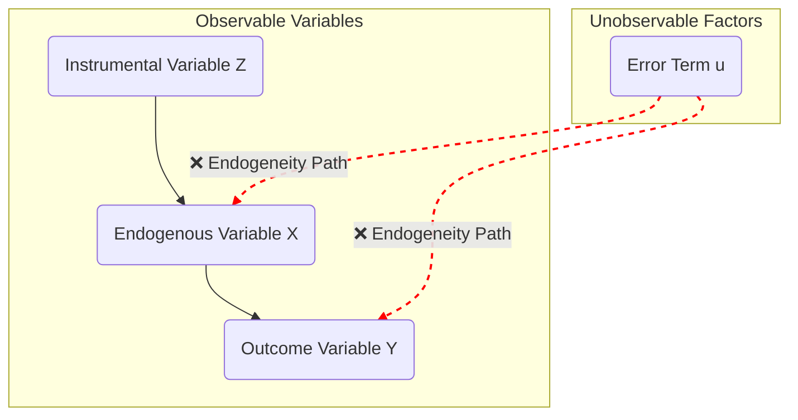

## Is the Correlation We See Really 'Causation'?

There's a famous statistic that "when ice cream sales increase, shark attacks also increase." Hearing this alone makes it seem like ice cream makes sharks more aggressive. But is this really true? Of course not. It's just a spurious correlation that appears because the hidden factor of 'hot weather' simultaneously increases both ice cream sales and the number of beachgoers.

This mistake of confusing correlation with causation in data analysis is very common, and is called the **Endogeneity** problem. The OLS regression analysis we trust and use can betray us and lead to wrong conclusions precisely because of this endogeneity problem.

## 1. Why Is OLS Alone Insufficient? The Endogeneity Problem

The regression analysis (OLS) we commonly use is a powerful tool for estimating causation: "When X changes, how much does Y change?"

### 1-1. Basic OLS Regression Equation

The standard OLS regression model is expressed as follows:

$$
Y = \beta_0 + \beta_1 X + \beta_2 W + u
$$

- $Y$: Outcome variable (dependent variable)
- $X$: Explanatory variable of interest
- $W$: Control variables (exogenous variables)
- $u$: Error term (unobserved factors)
- $\beta_1$: The causal effect of X we want to estimate

The reason for including control variable $W$ is that factors other than $X$ can affect $Y$. By controlling for these variables, we try to isolate the pure effect of $X$.

### 1-2. Core Assumption of OLS

One of the core assumptions for OLS to estimate accurate causation is that **the explanatory variable (X) should have no correlation with the error term (u) $(Cov(X, u)=0)$**. The error term $u$ contains numerous factors (talent, weather, luck, etc.) that we couldn't include in the model.

Real-world data often violates this assumption, which is called the **Endogeneity** problem. Endogeneity mainly arises from three causes:

1. **Omitted Variable Bias**: Occurs when an important variable (Z) that simultaneously affects both Y and X is left out of the model. (Example: When analyzing the effect of education level (X) on wages (Y), failing to control for individual 'ability')
2. **Simultaneity Bias**: When X affects Y, but Y also affects X simultaneously. (Example: The relationship between number of police officers (X) and crime rate (Y))
3. **Measurement Error**: Occurs when there is non-random measurement error in the explanatory variable X.

When endogeneity problems exist, the OLS estimator becomes biased and loses consistency, making the coefficient of X we found $(\hat{\beta_1})$ unreliable.

## 2. The Solution to Endogeneity: Enter the Instrumental Variable (IV)

What emerged to solve this endogeneity problem is precisely the **Instrumental Variable (IV)**. An instrumental variable `Z` is a third variable that is related to the endogenous explanatory variable `X` but has no direct effect on the outcome variable `Y`.

The two core conditions for being a good instrumental variable are as follows:

> 1. **Relevance Condition**: The instrumental variable (Z) must have a strong correlation with the endogenous variable (X).
>     - $Cov(Z, X) \neq 0$
>     - That is, when Z changes, X must move predictably.
> 2. **Exclusion Restriction**: The instrumental variable (Z) must affect the outcome variable (Y) **only through the endogenous variable (X)**. That is, Z should not have a direct effect on Y.
>     - $Cov(Z, u) = 0$
>     - This is the most core and powerful assumption of IV analysis. This assumption cannot be statistically verified and must be justified based on theory and logic.

The path diagram below intuitively shows this relationship. Endogeneity occurs because the unobserved factor `u` affects both `X` and `Y`. The instrumental variable `Z` must affect `X` (relevance) but have no direct connection to `Y` or `u` (exclusion restriction).

### Example: Education and Wages

- **Research Question**: If education (X) increases by one year, how much will wages (Y) increase?
- **Endogeneity Problem**: The omitted variable of an individual's innate 'ability' affects both education level and wages.
- **Instrumental Variable (Z) Idea**: Distance between residence and university
  - **Relevance**: All else being equal, students living near a university are more likely to attend university. $(Cov(distance, education) \neq 0)$
  - **Exclusion Restriction**: 'Distance' to a university itself wouldn't directly affect an individual's wages. We can assume it affects wages only through the path of raising 'education level'. (Wages don't suddenly rise just because the distance is close)

At this point, using the instrumental variable of 'distance to university', we can estimate a value close to the pure causal effect - the return to education for people who went to university more because the distance was close, regardless of 'ability'.

## 3. The Mechanism of Two-Stage Least Squares (2SLS)

Two-Stage Least Squares (2SLS) is the most representative method of estimating causation using instrumental variables (IV). As the name suggests, it consists of two stages of regression analysis.

### 3-1. How 2SLS Works

The first stage process is like a "purification filter that filters out impurities (correlation with error term u)" called endogeneity from the explanatory variable X. It's the process of passing through the filter called instrumental variable Z to obtain clean water $(\hat{X})$ explained only by exogenous factors. And in the second stage, we measure the pure relationship with `Y` using this purified water.

#### Stage 1 (First Stage): Extracting Only the Non-Endogenous Part from X

We place the endogenous explanatory variable `X` as the dependent variable and run a regression with the instrumental variable `Z` and other exogenous control variables (`W`) as explanatory variables.

$$
X = \pi_0 + \pi_1 Z + \pi_2 W + v
$$

The purpose of this regression is to separate out the part of X's variation that is explained only by the instrumental variable `Z`. We obtain the predicted value of X $(\hat{X})$ obtained at this stage. Since this $\hat{X}$ consists only of `Z` and `W`, it becomes a "clean X" with no correlation with the original error term (`u`) of Y.

#### Stage 2 (Second Stage): Estimating the True Effect with Clean X

Instead of the problematic `X` from the original regression equation, we run a regression using the clean predicted value $\hat{X}$ obtained in stage 1.

$$
Y = \beta_0 + \beta_1 \hat{X} + \beta_2 W + u
$$

The $\hat{\beta_1}$ obtained here is precisely the **consistent estimator** of the causal effect of X we're looking for, with the endogeneity problem resolved.

### 3-2. Statistical Testing of Instrumental Variable Conditions

#### Test of Relevance

1. First, check whether the coefficient of instrumental variable `Z` ($\pi_1$) in the first stage regression is statistically significant (reject $H_0: \pi_1=0$).
2. But more importantly, check for the **Weak Instrument** problem. If the correlation between `Z` and `X` is too weak, the bias of the 2SLS estimator becomes large and the standard error becomes inaccurate.
    - **Testing Method**: Check the F-statistic for the excluded instruments in the first stage regression. Generally, if $F > 10$, the weak instrument problem can be avoided. (Rule of thumb from Staiger & Stock, 1997)
    - **Caution**: If the F-statistic is below 10, the 2SLS estimator has large bias and becomes similar to the original OLS estimator, causing serious problems. In other words, we used IV to solve the endogeneity problem, but it's not solved and only the standard error increases, potentially ruining the analysis.

#### Test of Exclusion Restriction

As mentioned earlier, this assumption is fundamentally impossible to statistically verify. However, when the number of instrumental variables (`Z`) is greater than the number of endogenous variables (`X`) (called being over-identified), an indirect test can be performed.

- **Testing Method**: Overidentification Test (e.g., Sargan-Hansen J-test). The idea of this test is "if all instrumental variables are truly exogenous, additional instrumental variables should have no correlation with the error term of the second stage regression."
- **Interpretation**: The null hypothesis ($H_0$) is "all instrumental variables are exogenous." Therefore, "a large p-value that fails to reject the null hypothesis" is a good result.

### 3.3. Intuitive Understanding of the IV Estimator

2SLS is a representative method using instrumental variables, but the principle of instrumental variables can be understood with a simpler formula. Let's consider the simplest model without control variable W. The IV estimator at this time is expressed as follows:

$$\hat{\beta}_{IV} = \frac{Cov(Z, Y)}{Cov(Z, X)}$$

This formula compactly shows the essence of IV.

- **Numerator ($Cov(Z, Y)$)**: When instrumental variable Z changes, how much does outcome variable Y change? (Total relationship of Z → Y)
- **Denominator ($Cov(Z, X)$)**: When instrumental variable Z changes, how much does endogenous variable X change? (Relationship of Z → X, i.e., first stage)

Ultimately, the IV estimator is **"the total effect of Z on Y divided by the power of Z to move X"**. Since we assumed that Z can affect Y only through X (exclusion restriction), by calculating this ratio, we indirectly estimate the pure causal effect ($\beta_1$) of X on Y.

Show derivation process

Structural equation:

$$
Y = \beta_0 + \beta_1 X + u
$$

(Here we use a model without control variable W for explanation. According to the Frisch-Waugh-Lovell theorem, the value of $\hat{\beta}_1$ obtained by running 2SLS in $Y = \beta_0 + \beta_1 X + \beta_2 W + u$ is mathematically identical to the value of $\hat{\beta}_1$ obtained using instrumental variable `Z*` in $Y^* = \alpha_0 + \beta_1 X^* + \text{error}$ after first removing the effect of W.)

Core assumptions:

1. Relevance: $Cov(Z, X) \neq 0$
2. Exclusion restriction: $Cov(Z, u) = 0$

Derivation process:

1. Take the covariance with instrumental variable Z on both sides of the structural equation.
    $$Cov(Z, Y) = Cov(Z, \beta_0 + \beta_1 X + u)$$
2. Expand the right side using the properties of covariance ($Cov(A, B+C) = Cov(A,B) + Cov(A,C)$, $Cov(A, constant) = 0$).
    $$Cov(Z, Y) = Cov(Z, \beta_0) + Cov(Z, \beta_1 X) + Cov(Z, u)$$
    $$Cov(Z, Y) = 0 + \beta_1 Cov(Z, X) + Cov(Z, u)$$
3. Apply the exclusion restriction assumption ($Cov(Z, u) = 0$).
    $$Cov(Z, Y) = \beta_1 Cov(Z, X) + 0$$
4. Solve for $\beta_1$. (Under the relevance assumption ($Cov(Z, X) \neq 0$), we can divide both sides.)
    $$\beta_1 = \frac{Cov(Z, Y)}{Cov(Z, X)}$$

Therefore, the estimator of $\beta_1$ is as follows.
$$\hat{\beta}_{IV} = \frac{\widehat{Cov}(Z, Y)}{\widehat{Cov}(Z, X)}$$

## 4. Can 2SLS Results Be Interpreted Like OLS?

Let's assume we've luckily found a theoretically perfect IV. Then is the coefficient estimated by 2SLS $\hat{\beta}_{2SLS}$ equal to the **'Average Treatment Effect for all subjects'** that we tried to estimate with OLS?

### 4-1. What Does 2SLS Estimate? - LATE (Local Average Treatment Effect)

To conclude first, not necessarily.

The 2SLS estimator consistently estimates not the average effect of the entire population (ATE), but the effect of a very special subgroup, that is, the **Local Average Treatment Effect (LATE)**.

LATE means the average causal effect that appears only in the group that changed their behavior regarding the endogenous variable (X) because of the change in the instrumental variable (Z), that is, "Compliers." This may be a different concept from the average effect of 'all subjects' that OLS tried to estimate, and understanding this difference is key to accurately interpreting IV analysis results.

#### Example: Vietnam War Draft Service and Lifetime Earnings (Angrist & Krueger, 1991)

- **Research Question**: What is the effect of military service (X) on income (Y)?
- **Instrumental Variable (Z)**: Draft lottery number (receiving a low number increases the probability of being drafted)

At this point, 2SLS measures the effect on the income of "people who were inevitably drafted into the military because of the draft system (Compliers)." It doesn't measure the effect on volunteers (Always-Takers) or people who would avoid military service by any means (Never-Takers). This is a very important concept with great policy implications.

## 5. Example Use of IV Methodology: Institutions and Economic Growth (Acemoglu, Johnson, and Robinson, 2001)

The concept of LATE makes the interpretation of IV/2SLS more complex, but rather has the advantage of clearly showing 'what mechanism' the instrumental variable identifies causation through. One of the studies that best demonstrates this power of IV is Acemoglu, Johnson, and Robinson (AJR)'s 2001 paper analyzing the relationship between institutions and economic growth.

- **Research Question**: Do good institutions (X, e.g., protection of property rights) increase GDP per capita (Y)?
- **Endogeneity Problem**: Wealthy countries may have the luxury to create good institutions (simultaneity), and third factors like geography or culture may affect both institutions and growth (omitted variables).
- **Instrumental Variable (Z)**: European settler mortality rates during colonial settlement in the early 19th century
  - **Relevance**: In areas with high settler mortality (e.g., malaria-infested areas), Europeans created 'extractive' institutions that only extracted resources rather than settling down to live. On the other hand, in areas with low mortality where it was good to live (USA, Australia, etc.), they transplanted **'inclusive' institutions** to protect their own property. Therefore, past mortality rates have a strong negative correlation with current institutional quality.
  - **Exclusion Restriction**: We assume that past settler mortality affects current GDP per capita only through the path of 'institutions.' That is, it's a strong assumption that the disease environment of the past doesn't directly affect economic growth in the late 20th century. There have been numerous subsequent debates about this assumption, which is a representative case showing how good IV papers stimulate academic discussion.

The case of AJR (2001) shows the essence of IV/2SLS analysis. It's not simply applying complex statistical techniques, but rather close to an art of creative research design based on deep understanding of history and theory.

## Conclusion: A Tool of Causal Inference Close to Art

In conclusion, the instrumental variable methodology for solving OLS's endogeneity problem is a very powerful tool for inferring causation across the social sciences. However, its power depends on the very strict condition of **"Can we find a good instrumental variable?"**

IV/2SLS is not an automated technique where you press a button to get results. Researchers must persistently argue why the instrumental variable they found satisfies the relevance assumption and why it doesn't violate the exclusion restriction assumption. They must also clearly recognize that the result is a **"local"** effect for a specific group (Compliers), not the whole.

This process of consideration and argumentation is precisely the charm of econometrics, taking one step closer to true causation through data.

---

## References

_Angrist, Joshua D., and Jörn-Steffen Pischke (2015). Mastering 'Metrics: The Path from Cause to Effect. Princeton University Press._
_Angrist, J. D., & Pischke, J.-S. (2009). Mostly harmless econometrics: An empiricist's companion. Princeton University Press._
_Greene, W. H. (2018). Econometric analysis (8th ed.). Pearson._
