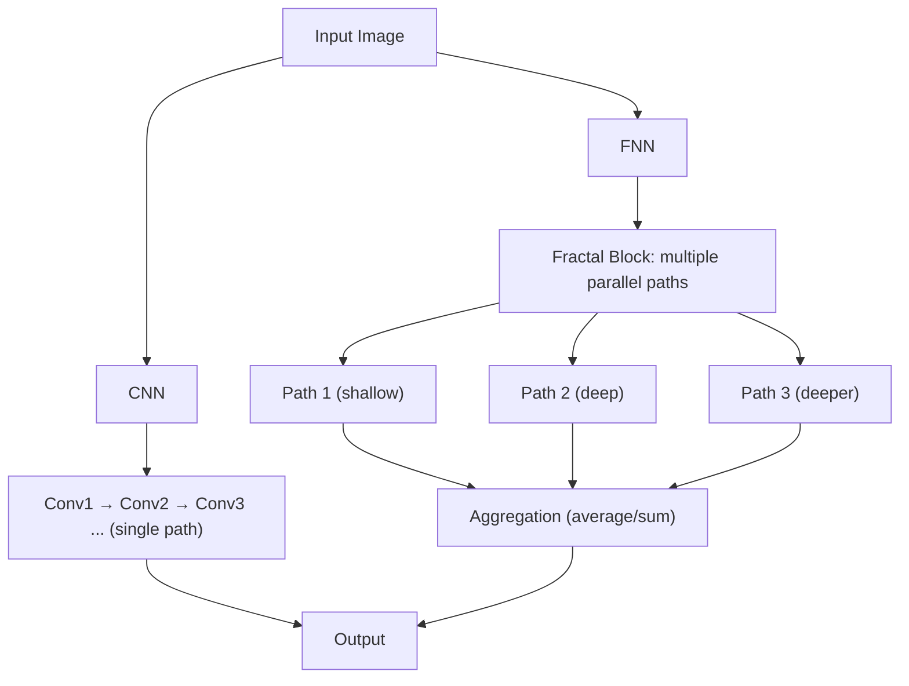

## Remember 'Fractals' from Math Class?

    
     
    <a href="https://imgur.com/gallery/NIRi3cb">
        Koch snowflake
    </a>

You probably remember those strange and beautiful images—fractals—that math teachers might have posted on classroom walls. Like how large tree branches resemble small trees, and those branches' branches also look like trees, patterns repeat infinitely no matter how much you zoom in.

Surprisingly, years later, that concept is being revisited in cutting-edge artificial intelligence. This is the story of Fractal Neural Networks (FNN). A recently published paper used FNN to significantly improve the performance of detecting military aircraft in satellite images compared to traditional CNNs.

## What Are Fractal Neural Networks (FNN)?

Fractal Neural Networks (FNN), particularly **FractalNet**, are models that apply fractal structures' self-replication principles to neural network architectures.
While CNNs sequentially stack convolutional layers, FNN **recursively expands** units called **fractal blocks** to create parallel pathways.

### Key Features

- **Recursive Expansion**: Blocks are expanded using the same rule, seeming complex at first but actually being "repetition of the same structure."
- **Multi-path Learning**: Simultaneously learns paths of various depths in parallel.
- **Drop-path Regularization**: During training, randomly blocks some paths using local drop-path (removing only some at junctions) or global drop-path (removing entire paths block-wise) to prevent overfitting. This is a unique regularization approach rarely seen in standard CNNs.

    
     
    <a href="https://www.tandfonline.com/doi/full/10.1080/08839514.2024.2440839#d1e225">
        Schematic representation of the diagram of the constructed FNN architecture.
    </a>

## CNN vs FNN Structural Differences

- **CNN**: Serial path (single pipeline)
- **FNN**: Parallel paths (multiple depths simultaneously), combined through Aggregation

## Building the Dataset

One important contribution of this paper was **data collection itself**. Since no appropriate public dataset existed, the research team used coordinates from a Russian military facility map produced by the 'Georgia Foundation for Strategic and International Studies' and directly collected aircraft images from Google Earth satellite photos.
Ultimately, a dataset was built with 5 categories including attack helicopters, fighter aircraft, Il-76 transport aviation, strategic aviation (Tu-22, Tu-95, Tu-160), plus a "no aviation" class (total 871 images).

### Preprocessing

- Resize all images to 128×128 pixels
- Normalize pixel values to 0~1 range
- Vectorize classes with one-hot encoding
- Data split: Training (80%), Validation (10%), Test (10%)

## Dramatic Accuracy Increase Through Data Augmentation: 35% → 90% Leap

In initial experiments, FNN achieved only **35.22%** accuracy.
However, after applying data augmentation (rotation, scaling, horizontal flipping, etc.), **test accuracy jumped to 90.87%**.
This demonstrates that richer data is absolutely critical for complex models.

## Hyperparameter Search: Finding the Optimal Combination

The research team experimented with various learning rates, batch sizes, and network depths.

- **Learning Rate Comparison**

  - 0.0001 → Unstable, overfitting tendency
  - 0.00001 → Stable convergence, improved accuracy

- **Batch Size Comparison**

  - 16 → Optimal (accuracy 93.26%, loss 0.2856)
  - 32/64 → More stable but lower accuracy

- **Depth Comparison**

  - 24 vs 32 layer models
  - Performance was similar but 32 layers had slight advantage (93.26% vs 92.69%)

Conclusively, lr=0.00001, batch_size=16, n_layer=32 structure was the optimal setting.

## Comparison with CNNs

Compared with VGG16 and ResNet50 under the same conditions:

| Model                | Test Accuracy | Test Loss |
| -------------------- | ------------- | --------- |
| **FNN (FractalNet)** | **93.26%**    | **0.2856** |
| ResNet50             | 91.14%        | 0.3571    |
| VGG16                | 85.9%         | 1.1727    |

Particularly, FNN showed **much better performance in classifying bombers with similar appearances** like Tu-22 and Tu-95. This is because the multi-path structure simultaneously captured features at various scales.

## Conclusion: Potential and Limitations

The research demonstrated that FNN maintains or improves accuracy even in deep networks and proved performance advantages over CNNs.
However, clear limitations exist:

- **Computational Cost**: Recursive structure requires significant memory and GPU resources.
- **Data Dependency**: Without augmentation, achieved lower performance (35%) than even CNNs.
- **Ecosystem Lack**: While ResNet and VGG have abundant pre-trained models and libraries, FNN is still in early stages.

Nevertheless, this research presents a new direction in architecture design. It showed that **depth and generalization can be achieved simultaneously through self-replicating patterns**, not just by stacking layers.

---

## References

Shymanskyi, V., Ratinskiy, O., & Shakhovska, N. (2025). Fractal Neural Network Approach for Analyzing Satellite Images. *Applied Artificial Intelligence, 39*(1), 2440839. [https://doi.org/10.1080/08839514.2024.2440839](https://doi.org/10.1080/08839514.2024.2440839)
