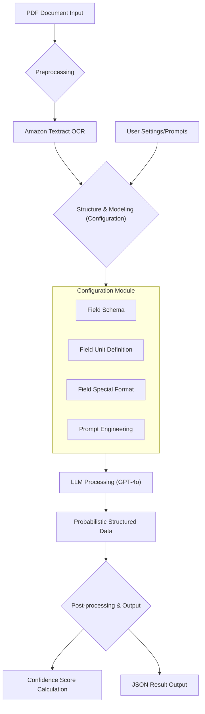

## The Real Challenge of Document Data Extraction

Data extraction seems simple, but as it scales, unexpected complexity emerges. This is especially true when extracting information from business documents.

For example, imagine needing to extract amount information from hundreds of invoices. Some invoices have "Amount Due" at the bottom, others say "Total". Yet another invoice has "Final Cost - Unpaid" at the top, and some have just numbers sitting there without any label.

That's not all. International goods transactions and domestic service fees are mixed, so various units like hourly rates, kilograms, pounds, metric tons coexist on one page. Some documents are clean digital files, but many are hard-to-read scans or photos. Each supplier uses different layouts and templates, making your head hurt trying to handle all variations.

And just when the system finally works, everything changes again. New formats, new layouts, new items appear, and your 'automated pipeline' returns to manual review stage. This is the **Schema Drift** problem.

Is there a way to consolidate all this chaos into structured data without needing to retrain or fine-tune new models every week? Today's paper presents a practical solution to precisely this problem.

## Hybrid Pipeline: A Practical Solution

The authors aim for a business document information extraction system that maximizes accuracy while minimizing training overhead. What makes this research special is that they validated the system not with clean academic datasets but with real invoices from a Taiwanese shipping company. With data that includes all the noise, variations, and inconsistencies of actual business environments.

The limitations of traditional approaches are clear. Simply applying OCR tools won't yield meaningful structured results. Likewise, deep learning models alone that require large amounts of labeled training data to handle various document types have their limits.

Therefore, the authors propose a **hybrid pipeline** that combines the reliability of proven OCR technology with the reasoning ability of Large Language Models (LLMs).

Applied KIE Pipeline Workflow

 

The core of this pipeline consists of three components:

1. **Amazon Textract (Eyes)**: Goes beyond simple OCR to extract structural information along with text from documents. Preserves relationships between elements like whether text is in a table or connected to specific labels.

2. **Configuration Module (Rulebook)**: Defines rules to solve schema problems ("Total" vs "Amount Due"), unit conversion problems ("kg" vs "lbs"), and domain knowledge problems ("8x20' container" = 8 twenty-foot containers).

3. **LLM (Brain)**: Takes structured text extracted by Textract and rules from Configuration Module as input, ultimately interpreting and reasoning the content to generate structured data.

## Prompt Engineering: Core Technology

The most sophisticated and core contribution of this system is the **prompt engineering** part. Traditional information extraction models learn specific patterns from large amounts of data, but have poor generalization performance and difficulty adapting to new document types.

In contrast, LLMs already understand language and context, so the key is guiding this understanding to apply to specific tasks. The authors explore three approaches to solve this problem.

### 1. Manual Prompt Engineering

A method where human experts directly write prompts based on domain knowledge and LLM characteristics. Can achieve good performance, but scalability issues are clear as prompts must be rewritten whenever new document types are added.

### 2. Automatic Prompt Engineering (APE)

Approaches prompt optimization itself as a machine learning problem. Not just using LLMs to process documents, but also generating and improving the prompts that guide document processing.

APE generates multiple candidate prompts based on basic task descriptions and a few input-output examples, evaluates each candidate on part of the data, and finds the best-performing prompt. This process can be formulated as the following optimization problem:

$$
p^* = \arg\max_p E_{(Q,A) \sim D} [f(p, Q, A)]
$$

Here, the goal is to find the optimal prompt $p^*$ that maximizes the score function $f$. APE has the advantage of exploring variations that humans might not think of and adapting to new document types without expert intervention.

### 3. Instruction Prompt Calibration (IPC)

A hybrid approach combining human expertise with automated optimization. In IPC, human annotators and LLMs each evaluate candidate prompts, and the final score is calculated as a weighted sum of both evaluations:

$$
S_{IPC}(\rho) = \alpha \times S_{human}(\rho) + (1-\alpha) \cdot S_{LLM}(\rho)
$$

Where $\alpha$ is the weight balancing between human judgment and LLM evaluation. Based on this calculated final score, the prompt receiving the highest score is selected as the optimal prompt:

$$\rho^*_{IPC} = \arg\max_{\rho} S_{IPC}(\rho)$$

Through this process, prompts that are not only performant but also interpretable and robust can be selected.

## Experimental Results: Real-World Validation

The authors applied this system to the SROIE benchmark (clean academic data) and real shipping company invoices (noisy industry data). The results were interesting:

- On the clean SROIE dataset, achieved high document extraction accuracy of 91.5%.
- However, performance somewhat declined on the real test: industry documents. Nevertheless, APE-optimized prompts recorded 88.2% document accuracy on GPT-4o model, showing consistently superior performance over manual prompts or IPC.
- Particularly, this system significantly surpassed general baselines like QA or DocQuery.

## Conclusion: Direction of Practical Document AI

The direct lesson from this paper is that 'prompt optimization, especially APE, makes LLM-based information extraction practically applicable to noisy and variable business documents.'

But the more important implication is that the future of document AI doesn't lie only in better OCR or bigger models. The key lies in 'how to orchestrate them harmoniously through prompts, rules, and human-in-the-loop calibration to handle real-world complexity that laboratory benchmarks hide.'

This research shows an important step in that direction. While presenting a practical solution to the real problem of schema drift, it simultaneously proposes a new paradigm for the document AI field.

-----

## References

Chen, L.-C., Weng, H.-T., Pardeshi, M. S., Chen, C.-M., Sheu, R.-K., & Pai, K.-C. (2025). Evaluation of Prompt Engineering on the Performance of a Large Language Model in Document Information Extraction. *Electronics*, *14*(11), 2145. [https://doi.org/10.3390/electronics14112145](https://doi.org/10.3390/electronics14112145)
