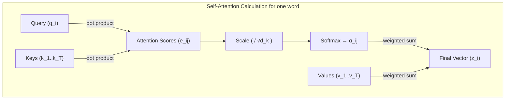

이 글은 이전 파트 [Seq2Seq와 Attention 메커니즘](https://jkim1209.github.io/posts/Attention/)에서 이어집니다.

## 8. 새로운 질문: RNN 없이 Attention만으로 문장을 이해할 수 없을까?

우리가 살펴본 어텐션 메커니즘은 Seq2Seq 모델의 고질적인 문제였던 '정보 손실'을 해결하며 번역 품질을 획기적으로 높였습니다. 하지만 근본적인 한계는 여전히 남아있었습니다. 바로 **RNN의 순차적인(Sequential) 계산 방식**입니다.

RNN(LSTM, GRU 포함)은 문장의 첫 단어부터 마지막 단어까지 순서대로 계산을 진행합니다.

* **단점 1: 느린 속도**: 단어를 하나씩 순차적으로 처리해야 하므로, 문장이 길어질수록 계산 시간이 선형적으로 늘어납니다. 병렬 처리가 어려워 GPU의 성능을 최대로 활용하지 못합니다.
* **단점 2: 정보의 거리 문제**: 어텐션이 있더라도, 문장 양 끝에 있는 단어들처럼 물리적으로 거리가 먼 단어 간의 관계를 파악하는 것은 여전히 어려웠습니다.

이 시점에서 구글 연구원들은 다음과 같은 대담한 질문을 던집니다.

> "RNN을 아예 없애버리고, 오직 어텐션만으로 문장 내 단어들의 관계와 의미를 파악할 수는 없을까?"

이 질문에 대한 답이 바로 **트랜스포머(Transformer)** 이며, 그 핵심 아이디어가 **셀프 어텐션(Self-Attention)** 입니다. 논문 제목 **'Attention is All You Need'** 는 이러한 배경을 함축적으로 보여줍니다.

-----

## 9. 셀프 어텐션(Self-Attention): 문장 스스로 관계를 파악하다

지금까지 우리가 배운 어텐션은 **인코더의 Hidden State($h_j$)** 와 **디코더의 Hidden State($s_i$)** 라는 두 개의 다른 정보 사이의 관계를 계산했습니다. (Encoder-Decoder Attention; Cross-Attention)

**셀프 어텐션** 은 이름 그대로, **하나의 문장 내에서** 단어들끼리 서로의 관계를 파악하는 방식입니다. 즉, 인코더에서는 입력 문장 내에서, 디코더에서는 출력 문장 내에서 어텐션을 수행합니다.

예를 들어, "그는 강가에 있는 은행에 가서 돈을 인출했다." 라는 문장을 생각해 봅시다.

여기서 '은행'이 'financial bank'를 의미한다는 것을 우리는 '돈을 인출했다'라는 구절을 통해 알 수 있습니다. 셀프 어텐션은 이처럼 문장 내 다른 단어들과의 관계를 직접 계산하여 각 단어의 의미를 더 명확하게 파악하는 메커니즘입니다.

### Query, Key, Value (Q, K, V)의 등장

셀프 어텐션을 이해하기 위해 **Query, Key, Value** 개념을 새롭게 도입해 보겠습니다. 이는 우리가 이전에 봤던 어텐션 계산을 좀 더 일반화한 개념입니다.

* **Query (Q)**: 분석의 주체가 되는 단어. "내 의미를 파악하기 위해, 문장의 다른 단어들과 얼마나 관련이 있는지 물어보는" 주체입니다.
* **Key (K)**: 문장 내 모든 단어들이 가진 일종의 '꼬리표' 또는 '색인'입니다. Query가 자신과의 관련성을 파악하기 위해 비교하는 대상이 됩니다.
* **Value (V)**: 각 단어가 실제로 담고 있는 '의미' 또는 '정보'입니다. Key를 통해 Query와의 관련성(가중치)이 결정되면, 이 Value 값들이 가중합되어 최종 결과에 반영됩니다.

이전 어텐션에서는 디코더의 $s_i$가 **Query** 역할을, 인코더의 $h_j$가 **Key**와 **Value** 역할을 동시에 수행했다고 볼 수 있습니다. 셀프 어텐션에서는 이 세 가지 역할을 명확하게 분리하여 사용합니다.

-----

## 10. 셀프 어텐션의 계산 과정

그렇다면 문장 내 한 단어가 Q, K, V를 이용해 어떻게 자신의 의미를 재정의하는지 단계별로 살펴보겠습니다. 입력 문장 "I am a student"를 예로 들어 'I'라는 단어의 관점에서 진행해 보겠습니다.

1. **Q, K, V 벡터 생성**: 각 단어의 임베딩 벡터에 각각 다른 가중치 행렬($W^Q, W^K, W^V$)을 곱하여 그 단어의 Q, K, V 벡터를 만듭니다. 이 가중치 행렬들은 모델이 학습 과정에서 스스로 습득합니다.
    * $q_I = \text{Embedding}_I \times W^Q$
    * $k_I = \text{Embedding}_I \times W^K$
    * $v_I = \text{Embedding}_I \times W^V$
    * (문장 내 다른 모든 단어에 대해서도 동일하게 계산합니다.)

2. **어텐션 가중치($\alpha_{ij}$) 계산**: 'I'의 Query 벡터($q_I$)를 문장 내 모든 단어의 Key 벡터($k_j$)와 비교하여, 'I'가 각 단어에 얼마나 집중할지를 나타내는 가중치를 계산합니다. 이 과정은 **어텐션 스코어 계산**, **스케일링**, **소프트맥스** 단계를 포함하며, 하나의 수식으로 다음과 같이 표현할 수 있습니다.
    $$a_{ij} = \text{softmax}\left(\frac{q_i \cdot k_j}{\sqrt{d_k}}\right) = \frac{\exp\left(\frac{q_i \cdot k_j}{\sqrt{d_k}}\right)}{\sum_{l=1}^{L} \exp\left(\frac{q_i \cdot k_l}{\sqrt{d_k}}\right)}$$
    * **스코어 계산**: $q_I$와 각 $k_j$를 내적(dot product)하여 연관성 점수를 구합니다.
    * **스케일링**: 이 점수를 $\sqrt{d_k}$로 나누어 학습을 안정시킵니다. 만약 $d_k$가 클 경우, 내적 값의 분산이 커져 Softmax가 극단적인 값을 출력하는 것을 방지합니다.
    * **소프트맥스**: 계산된 모든 스코어를 합이 1인 확률 분포, 즉 최종 어텐션 가중치로 변환합니다.

3. **최종 출력 (가중합)**: 위에서 계산한 어텐션 가중치($a_{ij}$)를 각 단어의 **Value 벡터($v_j$)** 에 곱한 후 모두 더합니다. 이렇게 나온 최종 벡터($z_I$)는 **문장 전체의 문맥이 반영된 'I'의 새로운 표현**이 됩니다.
    $$z_i = \sum_{j=1}^{L} a_{ij} v_j$$

이 모든 과정을 문장 전체에 대해 한 번에 처리하는 행렬 수식은 다음과 같으며, 이는 위에서 설명한 단계별 계산을 압축적으로 나타냅니다.

$$\text{Attention}(Q, K, V) = \text{softmax}\left(\frac{QK^\top}{\sqrt{d_k}}\right)V$$



-----

## 11. 트랜스포머 아키텍처: Attention is All You Need

트랜스포머는 위에서 설명한 셀프 어텐션을 벽돌처럼 쌓아 만든 정교한 건축물입니다. 크게 **인코더**와 **디코더** 블록으로 나뉘는 점은 Seq2Seq와 동일하지만, 내부 구조는 완전히 다릅니다.

* 주요 구성 요소

1. **멀티-헤드 어텐션 (Multi-Head Attention)**: 한 번의 어텐션만 수행하는 대신, 여러 개의 '헤드'가 동시에 어텐션을 수행합니다. 이는 마치 하나의 문장을 여러 다른 관점(예: 문법적 관계, 의미적 관계 등)에서 동시에 바라보는 것과 같습니다. 각 헤드가 계산한 어텐션 결과를 하나로 합쳐서 더 풍부한 정보를 담아냅니다.

2. **포지셔널 인코딩 (Positional Encoding)**: RNN을 제거하면서 단어의 '순서' 정보를 잃어버렸습니다. 트랜스포머는 각 단어의 임베딩 벡터에 그 단어의 위치 정보를 담은 '포지셔널 인코딩' 벡터를 더해줌으로써 이 문제를 해결합니다.

3. **인코더 블록 (Encoder Block)**

      * 하나의 인코더 블록은 **멀티-헤드 셀프 어텐션**과 **피드 포워드 신경망(Feed Forward Network)**, 이렇게 두 개의 주요 서브층(sub-layer)으로 구성됩니다.
      * 각 서브층 다음에는 잔차 연결(Residual Connection)과 층 정규화(Layer Normalization)가 적용되어 학습을 돕습니다.
      * 트랜스포머는 이런 인코더 블록을 여러 개(논문에서는 6개) 쌓아서 만듭니다.

4. **디코더 블록 (Decoder Block)**

      * 디코더 블록은 3개의 서브층으로 구성됩니다.
      * **Masked Multi-Head Self-Attention**: 디코더가 정답을 예측할 때, 현재 예측하려는 단어 뒤에 오는 미래의 단어들을 참고하지 못하도록 마스킹(masking) 처리를 한 셀프 어텐션입니다.
      * **Encoder-Decoder Attention**: 바로 우리가 Seq2Seq에서 배웠던 그 어텐션입니다.  Query는 디코더의 이전 출력에서 오고, Key와 Value는 **인코더 전체의 출력**에서 옵니다.
      * **피드 포워드 신경망**

전체 구조는 다음과 같습니다.

<div align="center">
    
  <br>
  (출처: <a href="https://lilianweng.github.io/posts/2018-06-24-attention/">Attention? Attention!</a>)
</div>

아래에서는 각 요소에 대해서 좀 더 자세히 살펴봅니다.

-----

### 11.1 멀티-헤드 어텐션 (Multi-Head Attention)

하나의 어텐션(Single-Head Attention)은 문장 내 단어들의 관계를 하나의 관점에서 파악합니다. 이는 마치 한 명의 전문가가 책을 읽고 전체 내용을 요약하는 것과 같습니다. 유용하지만, 한 가지 관점에 치우칠 수 있습니다.

**멀티-헤드 어텐션**은 여러 명의 전문가(Head)가 각자 다른 관점(예: 문법 전문가, 의미 전문가, 문맥 전문가)에서 동시에 책을 읽고, 그들의 해석을 종합하여 훨씬 더 풍부하고 입체적인 결론을 내리는 것과 같습니다.

#### 작동 방식

1. **입력 분할 (Projection)**: 기존의 Q, K, V 벡터를 바로 사용하는 대신, '헤드'의 개수($h$)만큼 서로 다른 선형 변환(Linear Projection)을 거칩니다. 즉, $d_{model}$ 차원의 Q, K, V 벡터에 각각 다른 가중치 행렬 ($W^Q_i, W^K_i, W^V_i$) 을 곱하여, 각 헤드마다 더 작은 차원($d_k$, $d_v$)을 갖는 Q, K, V 세트를 만듭니다. 일반적으로 $d_k = d_v = d_{model}/h$로 설정하여 전체 파라미터 수를 유지합니다.

     $$head_i = \text{Attention}(QW_i^Q, KW_i^K, VW_i^V)$$

    * 여기서 $i$는 1부터 $h$까지의 헤드 인덱스입니다.
    * $W_i^Q, W_i^K, W_i^V \in \mathbb{R}^{d_{model} \times d_k}$ 는 각 헤드마다 고유하게 학습되는 가중치 행렬입니다.

2. **병렬 어텐션 수행**: $h$개의 헤드는 각자에게 주어진 Q, K, V 세트를 이용해 독립적으로 스케일드 닷-프로덕트 어텐션(Scaled Dot-Product Attention)을 **병렬**로 수행합니다. 각 헤드는 문장의 서로 다른 관계 측면에 집중하게 됩니다.

3. **결과 연결 및 통합 (Concatenation & Projection)**: $h$개의 헤드가 각각 계산한 결과 벡터($head_1, ..., head_h$)를 모두 옆으로 이어 붙입니다(Concatenate). 이렇게 합쳐진 큰 벡터는 다시 한번 선형 변환 (가중치 행렬 $W^O$ 곱하기) 을 거쳐 원래의 $d_{model}$ 차원으로 돌아옵니다. 이 최종 벡터가 멀티-헤드 어텐션의 출력이 됩니다.

     $$\text{MultiHead}(Q, K, V) = \text{Concat}(\text{head}_1, ..., \text{head}_h)W^O$$

    * $W^O \in \mathbb{R}^{hd_v \times d_{model}}$ 는 최종 출력을 위한 가중치 행렬입니다.
    * $W^Q, W^K, W^V$ 행렬들과 마찬가지로, $W^O$도 처음에는 임의의 값으로 시작하여, 모델이 정답을 더 잘 맞히는 방향으로 역전파(backpropagation)와 경사 하강법(gradient descent)을 통해 점진적으로 업데이트됩니다.

**결론**: 멀티-헤드 어텐션을 통해 모델은 단어 간의 관계를 단편적으로 보지 않고, 다양한 "표현 부분 공간(representation subspaces)"에서 동시에 정보를 추출하여 종합적인 판단을 내릴 수 있습니다.

-----

### 11.2 포지셔널 인코딩 (Positional Encoding)

셀프 어텐션은 문장 내 모든 단어 쌍의 관계를 직접 계산하므로, RNN처럼 순서에 의존하지 않습니다. 이는 병렬 계산을 가능하게 하지만, 동시에 "나는 학생이다"와 "학생이다 나는"을 구분하지 못하는 치명적인 단점을 야기합니다.

**포지셔널 인코딩**은 이 문제를 해결하기 위해 단어의 '절대적인 위치'와 '상대적인 위치' 정보를 벡터 형태로 만들어 단어 임베딩에 더해주는 기술입니다.

#### 작동 방식

논문에서는 주기 함수인 사인(sin)과 코사인(cos) 함수를 사용합니다. 각 위치($pos$)와 임베딩 벡터 내 차원($i$)에 대해 다음과 같이 계산됩니다.

$$PE_{(pos, 2i)} = \sin(pos / 10000^{2i/d_{\text{model}}})$$
$$PE_{(pos, 2i+1)} = \cos(pos / 10000^{2i/d_{\text{model}}})$$

* $pos$: 문장 내 단어의 위치 (0, 1, 2, ...)
* $i$: 임베딩 벡터 내의 차원 인덱스 (0, 1, 2, ...)
* $d_{model}$: 임베딩 벡터의 전체 차원

수식은 복잡해 보이지만, 핵심 아이디어는 간단합니다.

1. **고유한 위치 값**: 각 단어 위치($pos$)마다 고유한 인코딩 벡터 값을 가집니다.
2. **상대 위치 학습 용이**: 이 방식의 가장 큰 장점은 모델이 **상대적인 위치 관계**를 쉽게 학습할 수 있다는 점입니다. 특정 위치 $pos+k$의 포지셔널 인코딩은 $pos$의 포지셔널 인코딩을 선형 변환하여 표현할 수 있기 때문입니다. 이는 모델이 "내 뒤 3번째 단어"와 같은 관계를 이해하는 데 도움을 줍니다.

최종적으로 모델에 입력되는 벡터는 **단어 임베딩**과 **포지셔널 인코딩**을 합한 값이 됩니다.

`최종 입력 벡터 = Word Embedding(단어의 의미) + Positional Encoding(단어의 위치)`

-----

### 11.3 인코더 블록의 구조 (Encoder Block)

<div align="center">
    
  <br>
  (출처: <a href="https://lilianweng.github.io/posts/2018-06-24-attention/">Attention? Attention!</a>)
</div>

인코더 블록은 두 개의 주요 서브층(sub-layer)으로 구성되며, 각 서브층에는 특별한 장치가 추가되어 있습니다.

1. **첫 번째 서브층**: 멀티-헤드 셀프 어텐션
2. **두 번째 서브층**: 피드 포워드 신경망 (Position-wise Feed-Forward Network)

각 서브층의 출력에는 잔차 연결(Residual Connection)과 층 정규화(Layer Normalization)가 순서대로 적용됩니다.

 $$\text{LayerNorm}(x + \text{Sublayer}(x))$$

* **잔차 연결 (Add)**: 서브층의 입력($x$)을 서브층의 출력($\text{Sublayer}(x)$)에 그대로 더해주는 기법입니다. 이는 층이 깊어져도 정보가 소실되거나 기울기가 사라지는 문제를 막아주는 '정보 고속도로' 역할을 합니다. 즉, 기존 정보는 보존하면서 변화량만 학습하도록 돕습니다.
* **층 정규화 (Norm)**: 학습을 안정적이고 빠르게 만들어주는 기법입니다. 각 층의 출력 데이터 분포를 평균 0, 분산 1로 정규화합니다.

**피드 포워드 신경망**은 두 개의 선형 변환과 ReLU 활성화 함수로 구성되며, 어텐션을 거친 정보를 한 번 더 정교하게 가공하는 역할을 합니다. 중요한 점은 이 연산이 각 단어 위치마다 **독립적으로 동일하게** 적용된다는 것입니다.

 $$\text{FFN}(x) = \max(0, xW_1 + b_1)W_2 + b_2$$

* $x \in \mathbb{R}^{d_{model}}$: 입력 벡터 (어텐션 출력)
* $W_1 \in \mathbb{R}^{d_{model} \times d_{ff}}$: 첫 번째 선형 변환 가중치 (확장)
* $b_1 \in \mathbb{R}^{d_{ff}}$: 첫 번째 편향
* $W_2 \in \mathbb{R}^{d_{ff} \times d_{model}}$: 두 번째 선형 변환 가중치 (축소)
* $b_2 \in \mathbb{R}^{d_{model}}$: 두 번째 편향
* $d_{ff}$: 내부 은닉층 차원 (논문에서는 2048, $d_{model}$의 4배)

즉, $d_{model} \rightarrow d_{ff} \rightarrow d_{model}$ 순서로 차원이 변화하면서, 중간에 더 넓은 표현 공간에서 비선형 변환을 수행합니다.

-----

### 11.4 디코더 블록의 구조 (Decoder Block)

<div align="center">
    
  <br>
  (출처: <a href="https://lilianweng.github.io/posts/2018-06-24-attention/">Attention? Attention!</a>)
</div>

디코더 블록은 인코더 블록과 유사하지만, 번역과 같은 생성(generation) 작업을 위해 한 개의 서브층이 추가되어 총 3개의 서브층으로 구성됩니다.

1. **첫 번째 서브층**: 마스크드 멀티-헤드 셀프 어텐션
2. **두 번째 서브층**: 멀티-헤드 인코더-디코더 어텐션
3. **세 번째 서브층**: 피드 포워드 신경망

#### 마스크드 셀프 어텐션 (Masked Self-Attention)

디코더는 단어를 순차적으로 생성해야 합니다. 예를 들어, "나는" 다음에 "학생이다"를 예측할 때, 정답인 "학생이다"를 미리 보고 예측해서는 안 됩니다. **마스킹**은 이 '미래 정보 컨닝'을 방지하는 장치입니다.

어텐션 스코어를 계산한 직후, Softmax를 적용하기 전에 현재 예측하려는 위치보다 뒤에 있는 단어들의 스코어 값을 아주 작은 값(-무한대)으로 바꾸어 버립니다. 이렇게 하면 Softmax를 통과했을 때 해당 단어들의 어텐션 가중치가 0이 되어, 사실상 없는 단어처럼 취급됩니다.

#### 인코더-디코더 어텐션 (Encoder-Decoder Attention)

이 서브층이 바로 디코더가 인코더의 정보를 참고하는 다리 역할을 합니다. 작동 방식은 다음과 같습니다.

* **Query (Q)**: 이전 서브층(**마스크드 셀프 어텐션**)의 출력 벡터에서 가져옵니다. 즉, "내가 지금까지 생성한 단어들을 바탕으로, 이제 인코더의 어떤 정보가 필요할까?"라는 질문입니다.
* **Key (K) & Value (V)**: **인코더 스택의 최종 출력**에서 가져옵니다. 즉, 입력 문장 전체의 풍부한 문맥 정보입니다.

이 어텐션을 통해 디코더는 현재 생성하려는 단어와 가장 관련이 깊은 **입력 문장의 부분**에 집중하여 정보를 가져올 수 있습니다. 이는 우리가 Seq2Seq에서 배웠던 어텐션의 역할과 정확히 동일합니다.

-----

## 12. 트랜스포머의 학습 과정

앞서 트랜스포머 모델의 정적 구조를 살펴봤으니, 이제 트랜스포머가 어떻게 학습하는지 알아보겠습니다.  
구조를 이해했으니, 이제 실제로 어떻게 '똑똑해지는지' 살펴볼 차례입니다.

### 12.1 Teacher Forcing: 학습 시의 특별한 방법

실제 서비스에서 트랜스포머는 단어를 하나씩 순차적으로 생성합니다. 하지만 **학습할 때**는 다른 방식을 사용합니다.

예를 들어 "I am a student" → "나는 학생이다"를 학습한다고 해봅시다.

**추론 시 (실제 사용):**

```txt
디코더 입력: <start>            → 출력: "나는"
디코더 입력: <start> 나는        → 출력: "학생이다"
디코더 입력: <start> 나는 학생이다 → 출력: <end>
```

**학습 시 (Teacher Forcing):**

```txt
디코더 입력: <start> 나는 학생이다    (정답을 미리 다 보여줌!)
디코더 출력:  나는  학생이다  <end>   (각 위치에서 다음 단어 예측)
```

**Teacher Forcing의 장점:**

* **병렬 처리**: 모든 위치를 동시에 계산할 수 있어 학습 속도가 빠름
* **안정적 학습**: 이전 단계의 잘못된 예측이 다음 단계에 영향을 주지 않음

**핵심**: 학습할 때는 정답을 미리 보여주되, **Masked Self-Attention**으로 '미래 정보'는 가려서 컨닝을 방지합니다.

### 12.2 손실 함수: Cross-Entropy Loss

모델이 얼마나 틀렸는지 측정하는 방법입니다.

```txt
정답:     [0, 0, 1, 0, 0]  (3번째 단어 "학생이다"가 정답)
모델 예측: [0.1, 0.2, 0.6, 0.05, 0.05]  (3번째가 가장 높긴 하지만 확신 부족)

Cross-Entropy Loss = -log(0.6) = 0.51  (낮을수록 좋음)
```

모델이 정답에 더 높은 확률을 부여할수록 손실이 줄어듭니다. 학습 과정에서 이 손실을 최소화하도록 모든 가중치($W^Q, W^K, W^V, W^O, W_1, W_2$ 등)가 업데이트됩니다.

### 12.3 학습 과정의 전체 흐름

1. **Forward Pass**: 입력 문장을 넣고 각 위치에서 다음 단어 확률 계산
2. **Loss 계산**: 예측과 정답 비교하여 Cross-Entropy Loss 계산  
3. **Backward Pass**: 역전파를 통해 각 가중치의 기울기(gradient) 계산
4. **가중치 업데이트**: 경사하강법으로 가중치 조정
5. **반복**: 수많은 문장 쌍으로 이 과정을 반복

**중요한 점**: 모든 어텐션 헤드와 FFN의 가중치들이 **동시에** 학습되면서, 각자 문장의 다른 측면(문법, 의미, 문맥 등)을 담당하게 됩니다.

-----

## 13. 요약: 트랜스포머는 어떻게 동작하는가?

1. **입력 처리**: 입력 문장의 각 단어는 임베딩 벡터와 포지셔널 인코딩이 더해진 상태로 인코더 스택에 들어갑니다.
2. **인코더**: 인코더는 입력 문장에 대해 **셀프 어텐션**을 반복적으로 수행합니다. 이 과정을 거치면서 각 단어는 문장 전체의 문맥을 완벽하게 이해한 새로운 표현으로 바뀝니다.
3. **인코더-디코더 연결**: 인코더 스택의 최종 출력(Key, Value)은 디코더의 모든 블록에 전달되어, 디코더가 참고할 풍부한 '참고 자료' 역할을 합니다.
4. **디코더**: 디코더는 현재까지 생성한 단어들을 바탕으로 **마스크드 셀프 어텐션**을 수행하고, 그 결과를 Query로 사용하여 인코더의 출력에 **인코더-디코더 어텐션**을 수행합니다. 이 과정을 통해 다음에 나올 가장 확률 높은 단어를 예측합니다.
5. **반복**: 디코더는 `<end>` 토큰이 나올 때까지 이 과정을 반복하여 최종 출력 문장을 생성합니다.

-----

## 14. 트랜스포머의 성공 요인

이처럼 트랜스포머는 RNN을 완전히 배제하고 오직 다양한 종류의 어텐션만으로 문장을 이해하고 생성함으로써, 뛰어난 성능과 학습 속도를 달성하여 NLP 분야의 새로운 표준이 되었습니다. 트랜스포머가 이처럼 혁신적일 수 있었던 핵심 성공 요인을 다시 살펴보면 다음과 같습니다.

* **병렬 처리 극대화**: RNN의 순차적 계산 방식을 완전히 배제하고 문장 내 모든 단어를 동시에 처리하여 학습 속도를 획기적으로 개선했습니다.
* **장거리 의존성 문제 해결**: 문장 내 아무리 멀리 떨어진 단어라도 직접적인 Attention 연산을 통해 관계를 쉽게 학습할 수 있습니다.
* **높은 확장성**: 인코더와 디코더 블록을 여러 겹 쌓는(stacking) 간단한 방식으로 모델의 표현력을 쉽게 확장할 수 있습니다.

이러한 혁신적인 장점들 덕분에 트랜스포머 아키텍처는 이후 **BERT, GPT** 등 수많은 최신 자연어 처리 모델의 기반이 되었으며, 현재 AI 기술 발전에 가장 큰 영향을 미친 모델 중 하나로 평가받고 있습니다.

-----

## References

* [Attention Is All You Need](https://arxiv.org/abs/1706.03762)
* [Attention? Attention!](https://lilianweng.github.io/posts/2018-06-24-attention/)
* [The Transformer Family Version 2.0](https://lilianweng.github.io/posts/2023-01-27-the-transformer-family-v2/)
* [Explain the Transformer Architecture](https://aiml.com/explain-the-transformer-architecture/)
* [Transformer Architecture explained](https://medium.com/@amanatulla1606/transformer-architecture-explained-2c49e2257b4c)
* [How Transformers Work: A Detailed Exploration of Transformer Architecture](https://www.datacamp.com/tutorial/how-transformers-work)
