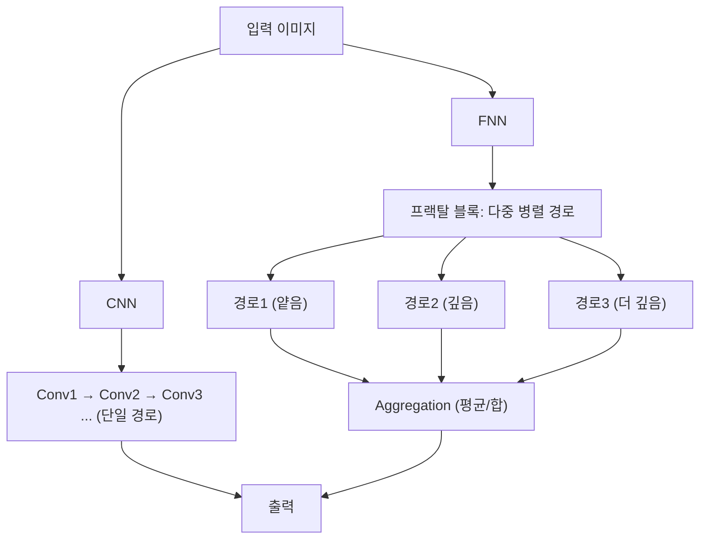

## 학창 시절 수학 시간에 봤던 '프랙탈', 기억하시나요?

    
    <a href="https://imgur.com/gallery/NIRi3cb" style="font-style: italic; color: #888; text-decoration: none; border-bottom: none;">
        Koch snowflake
    </a>

아마 수학 선생님이 교실 벽에 붙여 뒀을 법한 기묘하고 아름다운 이미지, 프랙탈을 기억하실 겁니다. 큰 나무의 가지가 작은 나무 모양이고, 그 가지의 가지가 또 다른 나무 모양인 것처럼, 아무리 확대해도 똑같은 패턴이 무한히 반복되는 구조 말이죠.

놀랍게도, 수년이 지난 지금 그 개념이 최첨단 인공지능 분야에서 다시 한번 다뤄지고 있습니다. 바로 프랙탈 신경망(FNN, Fractal Neural Networks) 이야기입니다. 최근 발표된 한 논문은 이 FNN을 이용해 위성 사진 속에서 군용기를 식별하는 성능을 기존 CNN 대비 크게 끌어올렸습니다.

## 프랙탈 신경망(FNN)이란 무엇인가?

프랙탈 신경망(FNN), 특히 **FractalNet**은 프랙탈 구조의 자기복제 원리를 신경망 아키텍처에 접목한 모델입니다.  
CNN이 컨볼루션 층을 순차적으로 쌓는 구조라면, FNN은 **프랙탈 블록**이라는 단위를 **재귀적으로 확장**하며 병렬 경로를 만들어냅니다.  

### 핵심 특징

- **재귀적 확장**: 동일한 규칙으로 블록을 확장하여 처음에는 복잡해 보이지만, 사실상 "같은 구조의 반복"입니다.  
- **다중 경로 학습**: 병렬적으로 여러 깊이의 경로를 동시에 학습합니다.  
- **Drop-path 정규화**: 학습 과정에서 일부 경로를 local drop-path(유니온 시 일부만 제거) 또는 global drop-path(블록 단위로 전체 경로 제거) 방식으로 무작위 차단해 과적합을 방지합니다. 이는 일반 CNN에서는 보기 힘든 독특한 정규화 방식입니다.

    
    <a href="https://www.tandfonline.com/doi/full/10.1080/08839514.2024.2440839#d1e225" style="font-style: italic; color: #888; text-decoration: none; border-bottom: none;">
        Schematic representation of the diagram of the constructed FNN architecture.
    </a>

## CNN vs FNN 구조 차이

- **CNN**: 직렬 경로(단일 파이프라인)
- **FNN**: 병렬 경로(여러 깊이 동시에), Aggregation으로 합침

## 데이터셋 구축하기

이 논문의 중요한 기여 중 하나는 **데이터 수집 자체**였습니다. 적절한 공개 데이터셋이 없었기 때문에 연구팀은 ‘조지아 전략 및 국제 연구 재단’이 제작한 러시아 군사시설 지도를 활용해 좌표를 확보하고, Google Earth 위성 사진에서 직접 항공기 이미지를 수집했습니다.
최종적으로 공격헬기(Attack helicopters), 전투기(Fighter aircraft), 수송기(Il-76 Transport aviation), 전략폭격기(Tu-22, Tu-95, Tu-160 Strategic Aviation) 등 5개 카테고리와 ‘항공기 없음(no aviation)’ 클래스까지 포함된 데이터셋이 구축되었습니다 (총 871장).

### 전처리

- 모든 이미지를 128×128 픽셀로 리사이즈
- 픽셀값을 0~1 범위로 정규화
- 원-핫 인코딩으로 클래스 벡터화
- 데이터 분할: 훈련(80%), 검증(10%), 테스트(10%)

## 데이터 증강을 통한 정확도의 비약적 상승: 35% → 90%의 도약

초기 실험에서 FNN은 **35.22%** 정확도에 불과했습니다.  
하지만 데이터 증강(회전, 크기 조절, 좌우 반전 등)을 적용하자, **테스트 정확도는 90.87%로 급등**했습니다.  
이는 복잡한 모델일수록 풍부한 데이터가 절대적으로 중요함을 보여줍니다.

## 하이퍼파라미터 탐색: 최적 조합 찾기

연구팀은 학습률과 배치 크기, 네트워크 깊이 등을 바꿔가며 실험했습니다.

- **학습률 비교**

  - 0.0001 → 불안정, 과적합 경향
  - 0.00001 → 안정적 수렴, 정확도 향상

- **배치 크기 비교**

  - 16 → 최적 (정확도 93.26%, 손실 0.2856)
  - 32/64 → 더 안정적이나 정확도 낮음
  
- **깊이 비교**

  - 24 vs 32 layer 모델
  - 성능은 유사했으나 32층이 소폭 우위 (93.26% vs 92.69%)

결론적으로 lr=0.00001, batch_size=16, n_layer=32 구조가 최적 세팅이었습니다.

## CNN과의 비교

같은 조건에서 VGG16, ResNet50과 비교했습니다.

| 모델                 | 테스트 정확도 | 테스트 손실 |
| -------------------- | ------------- | ----------- |
| **FNN (FractalNet)** | **93.26%**    | **0.2856**  |
| ResNet50             | 91.14%        | 0.3571      |
| VGG16                | 85.9%         | 1.1727      |

특히 Tu-22와 Tu-95 같은 **외형이 유사한 폭격기 분류에서 FNN이 훨씬 더 뛰어난 성능**을 보였습니다. 이는 다중 경로 구조가 다양한 스케일의 특징을 동시에 포착했기 때문입니다.

## 결론: 가능성과 한계

연구 결과, FNN은 깊은 네트워크에서도 정확도를 유지하거나 향상시키며, CNN 대비 성능 우위를 입증했습니다.
하지만 다음과 같은 제약도 분명 존재합니다.

- **연산량**: 재귀적 구조로 인해 메모리와 GPU 자원이 많이 필요합니다.
- **데이터 의존성**: 증강 없는 상태에서는 CNN보다도 낮은 성능(35%)을 기록했습니다.
- **생태계 부족**: ResNet·VGG는 사전 학습 모델과 라이브러리가 풍부하지만, FNN은 아직 초기 단계입니다.

그럼에도 불구하고, 본 연구는 아키텍처 설계의 새로운 방향성을 제시합니다. 단순히 층을 쌓는 것이 아니라, **자기복제 패턴을 통해 깊이와 일반화를 동시에 확보**할 수 있음을 보여주었습니다.

---

## References

Shymanskyi, V., Ratinskiy, O., & Shakhovska, N. (2025). Fractal Neural Network Approach for Analyzing Satellite Images. *Applied Artificial Intelligence, 39*(1), 2440839. [https://doi.org/10.1080/08839514.2024.2440839](https://doi.org/10.1080/08839514.2024.2440839)
