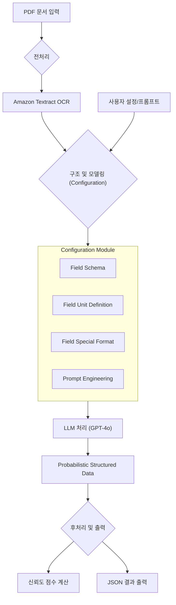

## 문서 데이터 추출의 현실적 도전

데이터 추출은 간단해 보이지만, 규모가 커지는 순간 예상치 못한 복잡성이 드러납니다. 특히 비즈니스 문서에서 정보를 추출할 때는 더욱 그렇습니다.

예를 들어, 수백 개의 인보이스에서 금액 정보를 추출해야 한다고 생각해보세요. 어떤 인보이스는 하단에 "Amount Due"라고 적혀있고, 다른 인보이스는 "Total"이라고 되어 있습니다. 또 다른 인보이스에는 상단에 "Final Cost - Unpaid"라고 쓰여있고, 어떤 것은 아무런 레이블 없이 숫자만 덩그러니 놓여 있습니다.

이것이 전부가 아닙니다. 국제 물품 거래와 국내 서비스 요금이 섞여있어서 시간당 요금, 킬로그램, 파운드, 미터톤 등 다양한 단위가 한 페이지에 공존합니다. 어떤 문서는 깨끗한 디지털 파일이지만, 상당수는 알아보기 어려운 스캔본이나 사진입니다. 각 공급업체마다 다른 레이아웃과 템플릿을 사용하고 있어서, 모든 변형을 처리하다 보면 머리가 아파옵니다.

그리고 겨우 시스템이 정상 작동하면, 모든 것이 다시 바뀝니다. 새로운 형식, 새로운 레이아웃, 새로운 항목이 등장하면서 당신의 '자동화 파이프라인'은 다시 수동 검토 단계로 돌아갑니다. 바로 **스키마 드리프트(Schema Drift)** 문제입니다.

매주 새로운 모델을 재학습하거나 미세조정할 필요 없이, 이 모든 혼돈을 구조화된 데이터로 통합하는 방법은 없을까요? 오늘 소개할 논문은 바로 이 문제에 대한 실용적인 해답을 제시합니다.

## 하이브리드 파이프라인: 현실적 해결책

저자들은 훈련 오버헤드를 최소화하면서도 정확도를 극대화하는 비즈니스 문서 정보 추출 시스템을 목표로 합니다. 이 연구의 특별한 점은 깨끗한 학술 데이터셋이 아닌, 대만 해운 회사의 실제 인보이스로 시스템을 검증했다는 것입니다. 실제 비즈니스 환경의 모든 노이즈, 변형, 불일치를 포함한 데이터로 말이죠.

전통적인 접근법의 한계는 명확합니다. 단순히 OCR 도구를 적용한다고 해서 의미 있는 구조화된 결과를 얻을 수는 없습니다. 마찬가지로, 다양한 문서 유형을 처리하려면 대량의 레이블링된 훈련 데이터가 필요한 딥러닝 모델만으로는 한계가 있습니다.

이에 저자들은 검증된 OCR 기술의 신뢰성과 대규모 언어 모델(LLM)의 추론 능력을 결합한 **하이브리드 파이프라인**을 제안합니다.

Applied KIE Pipeline Workflow

 

이 파이프라인의 핵심은 세 가지 구성 요소입니다:

1. **Amazon Textract (눈)**: 단순한 OCR을 넘어서 문서의 텍스트와 함께 구조적 정보를 추출합니다. 텍스트가 표 안에 있는지, 특정 레이블과 연결되어 있는지 등 요소 간의 관계를 보존합니다.

2. **Configuration Module (규칙서)**: 스키마 문제("Total" vs "Amount Due"), 단위 변환 문제("kg" vs "lbs"), 그리고 도메인 지식 문제("8x20' container" = 20피트 컨테이너 8개)를 해결하기 위한 규칙을 정의합니다.

3. **LLM (뇌)**: Textract가 추출한 구조화된 텍스트와 Configuration Module의 규칙을 입력받아, 최종적으로 내용을 해석하고 추론하여 구조화된 데이터를 생성하는 엔진 역할을 합니다.

## 프롬프트 엔지니어링: 핵심 기술

이 시스템에서 가장 정교하고 핵심적인 기여는 **프롬프트 엔지니어링** 부분입니다. 전통적인 정보 추출 모델은 대량의 데이터로 특정 패턴을 학습하지만, 일반화 성능이 떨어지고 새로운 문서 유형에 적응하기 어렵습니다.

반면 LLM은 이미 언어와 문맥을 이해하고 있으므로, 이 이해를 특정 작업에 적용하도록 유도하는 것이 핵심입니다. 저자들은 이 문제를 해결하기 위해 세 가지 접근법을 탐구합니다.

### 1. 수동 프롬프트 엔지니어링 (Manual Prompting)

인간 전문가가 도메인 지식과 LLM의 특성을 바탕으로 직접 프롬프트를 작성하는 방식입니다. 좋은 성능을 낼 수 있지만, 새로운 문서 유형이 추가될 때마다 프롬프트를 다시 작성해야 하는 확장성 문제가 명확합니다.

### 2. 자동 프롬프트 엔지니어링 (Automatic Prompt Engineering, APE)

프롬프트 최적화 자체를 하나의 머신러닝 문제로 접근합니다. LLM을 사용하여 문서를 처리할 뿐만 아니라, 문서 처리를 유도하는 프롬프트 자체를 생성하고 개선하는 것입니다.

APE는 기본 작업 설명과 몇 가지 입출력 예시를 바탕으로 여러 후보 프롬프트를 생성하고, 각 후보를 데이터의 일부로 평가하여 최고 성능의 프롬프트를 찾아냅니다. 이 과정은 다음과 같은 최적화 문제로 공식화할 수 있습니다:

$$
p^* = \arg\max_p E_{(Q,A) \sim D} [f(p, Q, A)]
$$

여기서 목표는 점수 함수 $f$를 최대화하는 최적의 프롬프트 $p^*$를 찾는 것입니다. APE는 인간이 생각하지 못한 변형을 탐색하고, 전문가의 개입 없이 새로운 문서 유형에 적응할 수 있다는 장점이 있습니다.

### 3. 지시 프롬프트 보정 (Instruction Prompt Calibration, IPC)

인간의 전문 지식과 자동화된 최적화를 결합한 하이브리드 접근법입니다. IPC에서는 인간 주석가와 LLM이 각각 후보 프롬프트를 평가하고, 두 평가를 가중 합산하여 최종 점수를 매깁니다:

$$
S_{IPC}(\rho) = \alpha \times S_{human}(\rho) + (1-\alpha) \cdot S_{LLM}(\rho)
$$

여기서 $\alpha$는 인간의 판단과 LLM의 평가 사이의 균형을 맞추는 가중치입니다. 이렇게 계산된 최종 점수를 바탕으로, 다음과 같이 가장 높은 점수를 받은 프롬프트가 최적의 프롬프트로 선택됩니다.

$$\rho^*_{IPC} = \arg\max_{\rho} S_{IPC}(\rho)$$

이 과정을 통해 성능뿐만 아니라 해석 가능하고 견고한 프롬프트를 선택할 수 있습니다.

## 실험 결과: 현실 검증

저자들은 이 시스템을 SROIE 벤치마크(깨끗한 학술 데이터)와 실제 해운사 인보이스(노이즈가 많은 산업 데이터)에 적용했습니다. 결과는 흥미로웠습니다:

- 깨끗한 SROIE 데이터셋에서는 91.5%의 높은 문서 추출 정확도를 달성했습니다.
- 하지만 진짜 시험대인 산업 문서에서는 성능이 다소 하락했습니다. 그럼에도 불구하고, APE로 최적화된 프롬프트는 GPT-4o 모델에서 88.2%의 문서 정확도를 기록하며, 수동 프롬프트나 IPC보다 일관되게 우수한 성능을 보였습니다.
- 특히, 이 시스템은 일반적인 QA나 DocQuery 같은 베이스라인 모델들을 큰 차이로 능가했습니다.

## 결론: 실용적 문서 AI의 방향

이 논문이 주는 직접적인 교훈은 '프롬프트 최적화, 특히 APE가 LLM 기반 정보 추출을 노이즈가 많고 가변적인 비즈니스 문서에 실용적으로 적용할 수 있게 만든다'는 것입니다.

하지만 더 중요한 시사점은 문서 AI의 미래가 단순히 더 나은 OCR이나 더 큰 모델에만 있지 않다는 점입니다. 핵심은 프롬프트, 규칙, 그리고 인간-참여형 보정(human-in-the-loop calibration)을 통해 '어떻게 이들을 조화롭게 오케스트레이션하여 실험실 벤치마크가 숨기고 있는 현실 세계의 복잡성을 처리하느냐'에 달려 있습니다.

이 연구는 그 방향으로 나아가는 중요한 한 걸음을 보여줍니다. 스키마 드리프트라는 현실적 문제에 대한 실용적 해결책을 제시하면서, 동시에 문서 AI 분야의 새로운 패러다임을 제안하고 있습니다.

-----

## References

Chen, L.-C., Weng, H.-T., Pardeshi, M. S., Chen, C.-M., Sheu, R.-K., & Pai, K.-C. (2025). Evaluation of Prompt Engineering on the Performance of a Large Language Model in Document Information Extraction. *Electronics*, *14*(11), 2145. [https://doi.org/10.3390/electronics14112145](https://doi.org/10.3390/electronics14112145)
